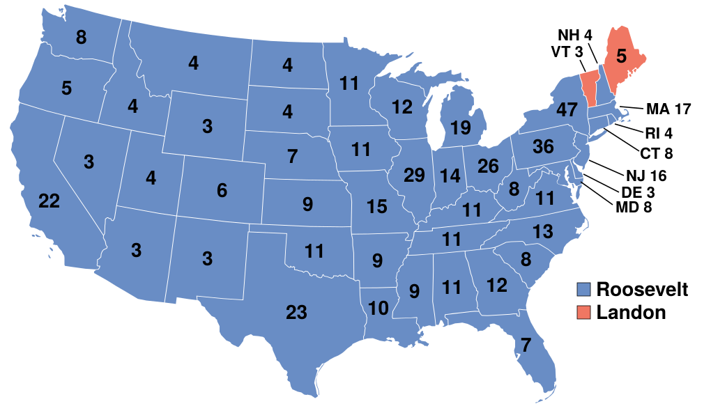
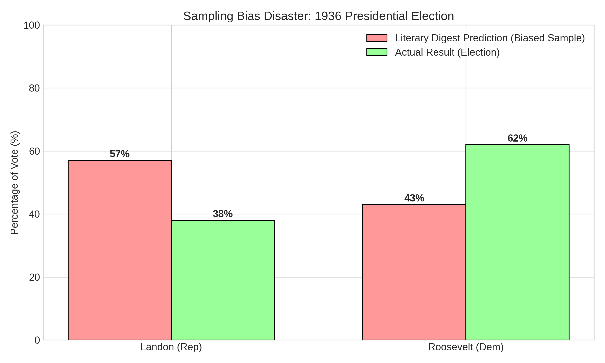

Xác suất là nền tảng của toàn bộ thống kê và machine learning. Trong bài học này, chúng ta sẽ xây dựng từ những khái niệm cơ bản nhất - không gian mẫu và biến cố - đến những công cụ mạnh mẽ như xác suất có điều kiện và định lý Bayes. Thay vì chỉ học công thức, chúng ta sẽ sử dụng mô phỏng để hiểu sâu sắc ý nghĩa của từng khái niệm.

---

## Không Gian Mẫu và Biến Cố

**Không gian mẫu (Sample Space)** $$\Omega$$ là tập hợp tất cả các kết quả có thể xảy ra của một thí nghiệm ngẫu nhiên.

**Biến cố (Event)** $$A$$ là một tập con của không gian mẫu, $$A \subseteq \Omega$$.

### Ví Dụ Cơ Bản

**Thí nghiệm 1: Tung đồng xu**
- $$\Omega = \{\text{Ngửa}, \text{Sấp}\}$$
- Biến cố "Ra ngửa": $$A = \{\text{Ngửa}\}$$

**Thí nghiệm 2: Gieo xúc xắc**
- $$\Omega = \{1, 2, 3, 4, 5, 6\}$$
- Biến cố "Ra số chẵn": $$A = \{2, 4, 6\}$$
- Biến cố "Ra số lớn hơn 4": $$B = \{5, 6\}$$

```python
import numpy as np
import matplotlib.pyplot as plt
from collections import Counter

def simulate_dice_roll(n_rolls=10000):
    """
    Mô phỏng gieo xúc xắc và tính tần suất các biến cố
    """
    # Mô phỏng gieo xúc xắc
    rolls = np.random.randint(1, 7, size=n_rolls)
    
    # Đếm tần suất
    counts = Counter(rolls)
    
    # Tính xác suất thực nghiệm
    prob_even = np.sum(rolls % 2 == 0) / n_rolls
    prob_greater_than_4 = np.sum(rolls > 4) / n_rolls
    
    # Vẽ biểu đồ
    fig, axes = plt.subplots(1, 2, figsize=(14, 5))
    
    # Histogram các mặt xúc xắc
    faces = list(range(1, 7))
    frequencies = [counts[i] / n_rolls for i in faces]
    axes[0].bar(faces, frequencies, alpha=0.7, color='steelblue')
    axes[0].axhline(1/6, color='red', linestyle='--', linewidth=2, label='Xác suất lý thuyết (1/6)')
    axes[0].set_xlabel('Mặt xúc xắc')
    axes[0].set_ylabel('Tần suất')
    axes[0].set_title(f'Phân Phối Tần Suất ({n_rolls:,} lần gieo)')
    axes[0].legend()
    axes[0].grid(True, alpha=0.3, axis='y')
    
    # So sánh xác suất lý thuyết và thực nghiệm
    events = ['Số chẵn', 'Số > 4']
    theoretical = [3/6, 2/6]
    empirical = [prob_even, prob_greater_than_4]
    
    x = np.arange(len(events))
    width = 0.35
    axes[1].bar(x - width/2, theoretical, width, label='Lý thuyết', alpha=0.8)
    axes[1].bar(x + width/2, empirical, width, label='Thực nghiệm', alpha=0.8)
    axes[1].set_ylabel('Xác suất')
    axes[1].set_title('So Sánh Xác Suất Lý Thuyết vs Thực Nghiệm')
    axes[1].set_xticks(x)
    axes[1].set_xticklabels(events)
    axes[1].legend()
    axes[1].grid(True, alpha=0.3, axis='y')
    
    plt.tight_layout()
    # plt.show()
    
    print(f"Kết quả sau {n_rolls:,} lần gieo:")
    print(f"  P(Số chẵn) = {prob_even:.4f} (lý thuyết: 0.5000)")
    print(f"  P(Số > 4) = {prob_greater_than_4:.4f} (lý thuyết: {2/6:.4f})")

# simulate_dice_roll(10000)
```

## Định Nghĩa Xác Suất

Có ba cách tiếp cận chính để định nghĩa xác suất:

### 1. Xác Suất Cổ Điển (Classical Probability)

Nếu tất cả các kết quả đều có khả năng xảy ra như nhau:

$$P(A) = \frac{\text{Số kết quả thuận lợi cho } A}{\text{Tổng số kết quả có thể}}$$

**Ví dụ:** Xác suất ra số chẵn khi gieo xúc xắc = $$\frac{3}{6} = \frac{1}{2}$$

### 2. Xác Suất Tần Suất (Frequentist Probability)

$$P(A) = \lim_{n \to \infty} \frac{\text{Số lần } A \text{ xảy ra}}{n}$$

Đây là cách tiếp cận thực nghiệm - xác suất là giới hạn của tần suất khi số lần thử tiến tới vô cùng.

### 3. Xác Suất Tiên Nghiệm (Axiomatic Probability - Kolmogorov)

Xác suất là một hàm $$P: \mathcal{F} \to [0, 1]$$ thỏa mãn ba tiên đề:

1. **Non-negativity:** $$P(A) \geq 0$$ với mọi biến cố $$A$$
2. **Normalization:** $$P(\Omega) = 1$$
3. **Additivity:** Nếu $$A$$ và $$B$$ rời nhau, thì $$P(A \cup B) = P(A) + P(B)$$

## Cạm Bẫy Trong Xác Suất: Chọn Mẫu Thiên Kiến (Sampling Bias)

> *"The sample with the built-in bias."* - Darrell Huff, *How to Lie with Statistics*

Khi ước lượng xác suất từ dữ liệu thực tế (theo cách tiếp cận tần suất), điều kiện tiên quyết là mẫu phải đại diện cho tổng thể (**representative**). Nếu quy trình chọn mẫu bị thiên kiến, xác suất tính được sẽ hoàn toàn sai lệch, bất kể mẫu lớn đến đâu.

### Ví Dụ Kinh Điển: Landon vs. Roosevelt (1936)
Năm 1936, tạp chí *Literary Digest* đã gửi mười triệu lá phiếu thăm dò qua đường bưu điện để dự đoán kết quả bầu cử tổng thống Mỹ. Họ nhận lại 2.4 triệu phản hồi - một con số khổng lồ!

*   **Dự đoán của Digest:** Landon thắng áp đảo Roosevelt (57% vs 43%).
*   **Kết quả thực tế:** Roosevelt thắng áp đảo (62% vs 38%).

**Tại sao sai?**
Tạp chí lấy địa chỉ từ danh bạ điện thoại và danh sách đăng ký ô tô. Năm 1936 là thời kỳ Đại Suy Thoái, chỉ người giàu mới có điện thoại và ô tô. Mẫu của họ, dù cực lớn, chỉ đại diện cho người giàu (những người có xu hướng ủng hộ Landon), bỏ qua hoàn toàn người nghèo (đa số ủng hộ Roosevelt).

**Bài học:** *A large biased sample is worse than a small random sample.*


*Bản đồ kết quả bầu cử 1936: Roosevelt (Xanh) thắng áp đảo Landon (Đỏ), trái ngược hoàn toàn với dự đoán của Literary Digest.*


*So sánh dự đoán của Literary Digest và kết quả thực tế.*

```python
def sampling_bias_demo():
    """
    Minh họa Sampling Bias sinh ra kết quả sai lệch như thế nào
    """
    # Tổng thể: 1 triệu dân, 60% ủng hộ A (Thắng), 40% ủng hộ B (Thua)
    population_size = 1000000
    true_proportion = 0.60
    
    # Tạo đặc điểm: 'Giàu' có xu hướng ủng hộ B nhiều hơn
    # Giả sử 20% dân số là Giàu, 80% là Nghèo
    # Người Giàu: 30% ủng hộ A, 70% ủng hộ B
    # Người Nghèo: 67.5% ủng hộ A, 32.5% ủng hộ B (để average ra 60% tổng thể)
    
    status = np.random.choice(['Rich', 'Poor'], size=population_size, p=[0.2, 0.8])
    vote = np.zeros(population_size, dtype=int) # 1=Vote A, 0=Vote B
    
    # Gán vote dựa trên status
    rich_indices = np.where(status == 'Rich')[0]
    poor_indices = np.where(status == 'Poor')[0]
    
    vote[rich_indices] = np.random.choice([1, 0], size=len(rich_indices), p=[0.3, 0.7])
    vote[poor_indices] = np.random.choice([1, 0], size=len(poor_indices), p=[0.675, 0.325])
    
    print("Tổng thể (Sự thật):")
    print(f"  Ủng hộ A: {vote.mean()*100:.1f}% (A Thắng)")
    print("-" * 30)
    
    # 1. Random Sample (Mẫu ngẫu nhiên chuẩn) - n=1000
    random_indices = np.random.choice(np.arange(population_size), size=1000, replace=False)
    random_sample = vote[random_indices]
    print(f"Random Sample (n=1000):")
    print(f"  Ủng hộ A: {random_sample.mean()*100:.1f}% (Dự đoán đúng)")
    
    # 2. Biased Sample (Giống Literary Digest) - n=2.4 triệu (ở đây mô phỏng 10,000)
    # Xác suất người Giàu trả lời cao gấp 10 lần người Nghèo (do có đt/ô tô)
    probs = np.where(status == 'Rich', 0.1, 0.01)
    probs = probs / probs.sum()
    
    biased_indices = np.random.choice(np.arange(population_size), size=10000, replace=False, p=probs)
    biased_sample = vote[biased_indices]
    
    print("-" * 30)
    print(f"Biased Sample (n=10,000 - Người giàu dễ được chọn hơn):")
    print(f"  Ủng hộ A: {biased_sample.mean()*100:.1f}% (Dự đoán SAI: B Thắng!)")
    print(f"  -> Mẫu lớn gấp 10 lần nhưng vẫn sai vì bias.")

# sampling_bias_demo()
```

## Các Quy Tắc Xác Suất Cơ Bản

### Quy Tắc Cộng (Addition Rule)

**Cho hai biến cố bất kỳ $$A$$ và $$B$$:**

$$P(A \cup B) = P(A) + P(B) - P(A \cap B)$$

**Nếu $$A$$ và $$B$$ rời nhau (mutually exclusive):** $$P(A \cap B) = 0$$, nên:

$$P(A \cup B) = P(A) + P(B)$$

```python
def visualize_addition_rule():
    """
    Minh họa quy tắc cộng bằng biểu đồ Venn
    """
    from matplotlib_venn import venn2
    
    fig, axes = plt.subplots(1, 2, figsize=(14, 5))
    
    # Trường hợp 1: Hai biến cố có giao
    axes[0].set_title('Hai Biến Cố Có Giao\nP(A∪B) = P(A) + P(B) - P(A∩B)', fontsize=12)
    v1 = venn2(subsets=(0.3, 0.4, 0.2), set_labels=('A', 'B'), ax=axes[0])
    v1.get_label_by_id('10').set_text('P(A\\B)\n= 0.3')
    v1.get_label_by_id('01').set_text('P(B\\A)\n= 0.4')
    v1.get_label_by_id('11').set_text('P(A∩B)\n= 0.2')
    
    # Trường hợp 2: Hai biến cố rời nhau
    axes[1].set_title('Hai Biến Cố Rời Nhau\nP(A∪B) = P(A) + P(B)', fontsize=12)
    v2 = venn2(subsets=(0.3, 0.4, 0), set_labels=('A', 'B'), ax=axes[1])
    v2.get_label_by_id('10').set_text('P(A)\n= 0.3')
    v2.get_label_by_id('01').set_text('P(B)\n= 0.4')
    
    plt.tight_layout()
    # plt.show()

# visualize_addition_rule()
```

### Quy Tắc Nhân (Multiplication Rule)

**Cho hai biến cố bất kỳ $$A$$ và $$B$$:**

$$P(A \cap B) = P(A) \cdot P(B|A) = P(B) \cdot P(A|B)$$

**Nếu $$A$$ và $$B$$ độc lập (independent):**

$$P(A \cap B) = P(A) \cdot P(B)$$

### Biến Cố Bù (Complement)

$$P(A^c) = 1 - P(A)$$

Đây là một trong những công thức hữu ích nhất trong thực tế!

```python
def birthday_problem_complement():
    """
    Sử dụng biến cố bù để giải bài toán sinh nhật
    """
    def prob_no_match_theoretical(n):
        """Tính xác suất KHÔNG có ai trùng sinh nhật (lý thuyết)"""
        if n > 365:
            return 0
        prob = 1
        for i in range(n):
            prob *= (365 - i) / 365
        return prob
    
    def prob_match_simulation(n, n_sims=10000):
        """Mô phỏng xác suất CÓ ít nhất 2 người trùng sinh nhật"""
        matches = 0
        for _ in range(n_sims):
            birthdays = np.random.randint(1, 366, size=n)
            if len(np.unique(birthdays)) < n:
                matches += 1
        return matches / n_sims
    
    # Thử với các nhóm khác nhau
    group_sizes = range(5, 51, 5)
    prob_theoretical = []
    prob_simulation = []
    
    for n in group_sizes:
        # Xác suất có trùng = 1 - xác suất không trùng
        prob_theoretical.append(1 - prob_no_match_theoretical(n))
        prob_simulation.append(prob_match_simulation(n, n_sims=5000))
    
    # Vẽ biểu đồ
    plt.figure(figsize=(12, 6))
    plt.plot(group_sizes, prob_theoretical, 'o-', linewidth=2, markersize=8, 
             label='Lý thuyết (dùng biến cố bù)', color='steelblue')
    plt.plot(group_sizes, prob_simulation, 's--', linewidth=2, markersize=6,
             label='Mô phỏng', alpha=0.7, color='orange')
    plt.axhline(0.5, color='red', linestyle='--', alpha=0.5, label='50%')
    plt.xlabel('Số người trong nhóm')
    plt.ylabel('Xác suất có ít nhất 2 người trùng sinh nhật')
    plt.title('Bài Toán Sinh Nhật: Sức Mạnh của Biến Cố Bù')
    plt.legend()
    plt.grid(True, alpha=0.3)
    # plt.show()
    
    # Tìm số người cần thiết để xác suất > 50%
    for i, n in enumerate(group_sizes):
        if prob_theoretical[i] > 0.5:
            print(f"Cần ít nhất {n} người để xác suất trùng sinh nhật > 50%")
            print(f"  Xác suất lý thuyết: {prob_theoretical[i]:.4f}")
            print(f"  Xác suất mô phỏng: {prob_simulation[i]:.4f}")
            break

# birthday_problem_complement()
```

## Xác Suất Có Điều Kiện (Conditional Probability)

**Định nghĩa:** Xác suất của $$A$$ khi biết $$B$$ đã xảy ra:

$$P(A|B) = \frac{P(A \cap B)}{P(B)}, \quad P(B) > 0$$

**Ý nghĩa:** Khi biết $$B$$ xảy ra, không gian mẫu "thu hẹp" lại chỉ còn $$B$$, và ta tính xác suất của $$A$$ trong không gian mới này.

### Ví Dụ: Bài Toán Bệnh Hiếm

Giả sử:
- 1% dân số mắc bệnh X
- Test cho kết quả dương tính với 99% người bệnh (sensitivity)
- Test cho kết quả dương tính với 5% người khỏe (false positive rate)

**Câu hỏi:** Nếu test dương tính, xác suất thực sự mắc bệnh là bao nhiêu?

```python
def rare_disease_simulation(n_population=100000):
    """
    Mô phỏng bài toán test bệnh hiếm
    """
    # Tạo dân số
    has_disease = np.random.rand(n_population) < 0.01  # 1% mắc bệnh
    
    # Thực hiện test
    test_positive = np.zeros(n_population, dtype=bool)
    
    # Người bệnh: 99% test dương tính
    test_positive[has_disease] = np.random.rand(has_disease.sum()) < 0.99
    
    # Người khỏe: 5% test dương tính (false positive)
    test_positive[~has_disease] = np.random.rand((~has_disease).sum()) < 0.05
    
    # Tính xác suất có điều kiện
    n_positive = test_positive.sum()
    n_positive_and_disease = (test_positive & has_disease).sum()
    
    prob_disease_given_positive = n_positive_and_disease / n_positive
    
    # Tính theo công thức (sẽ học ở phần Bayes)
    # P(D|+) = P(+|D) * P(D) / P(+)
    # P(+) = P(+|D)*P(D) + P(+|~D)*P(~D)
    p_d = 0.01
    p_pos_given_d = 0.99
    p_pos_given_not_d = 0.05
    p_pos = p_pos_given_d * p_d + p_pos_given_not_d * (1 - p_d)
    prob_theoretical = (p_pos_given_d * p_d) / p_pos
    
    print("Bài Toán Test Bệnh Hiếm:")
    print("=" * 50)
    print(f"Tổng số người: {n_population:,}")
    print(f"Số người mắc bệnh: {has_disease.sum():,} ({has_disease.sum()/n_population*100:.2f}%)")
    print(f"Số người test dương tính: {n_positive:,}")
    print(f"Số người test dương tính VÀ mắc bệnh: {n_positive_and_disease:,}")
    print()
    print(f"P(Bệnh | Test +) mô phỏng: {prob_disease_given_positive:.4f}")
    print(f"P(Bệnh | Test +) lý thuyết: {prob_theoretical:.4f}")
    print()
    print("⚠️  Mặc dù test có độ chính xác 99%, nhưng nếu test dương tính,")
    print(f"    xác suất thực sự mắc bệnh chỉ khoảng {prob_theoretical*100:.1f}%!")
    print("    Lý do: Bệnh quá hiếm, nên có nhiều false positives.")

# rare_disease_simulation(100000)
```

## Định Lý Bayes

Định lý Bayes là một trong những công cụ quan trọng nhất trong thống kê và machine learning:

$$P(A|B) = \frac{P(B|A) \cdot P(A)}{P(B)}$$

Hoặc dạng đầy đủ hơn:

$$P(A|B) = \frac{P(B|A) \cdot P(A)}{P(B|A) \cdot P(A) + P(B|A^c) \cdot P(A^c)}$$

**Terminology:**
- $$P(A)$$: **Prior probability** - xác suất ban đầu
- $$P(B|A)$$: **Likelihood** - khả năng quan sát $$B$$ khi $$A$$ đúng
- $$P(A|B)$$: **Posterior probability** - xác suất sau khi quan sát $$B$$

### Ví Dụ: Spam Filter

```python
def naive_bayes_spam_filter():
    """
    Minh họa Naive Bayes cho spam classification
    """
    # Dữ liệu giả định
    # P(Spam) = 0.3
    # P("free" | Spam) = 0.8
    # P("free" | Ham) = 0.1
    
    p_spam = 0.3
    p_ham = 0.7
    p_free_given_spam = 0.8
    p_free_given_ham = 0.1
    
    # Tính P(Spam | "free") bằng Bayes
    p_free = p_free_given_spam * p_spam + p_free_given_ham * p_ham
    p_spam_given_free = (p_free_given_spam * p_spam) / p_free
    
    print("Spam Filter với Định Lý Bayes:")
    print("=" * 50)
    print(f"Prior: P(Spam) = {p_spam:.2f}")
    print(f"Likelihood: P('free' | Spam) = {p_free_given_spam:.2f}")
    print(f"Likelihood: P('free' | Ham) = {p_free_given_ham:.2f}")
    print()
    print(f"Posterior: P(Spam | 'free') = {p_spam_given_free:.4f}")
    print()
    print(f"Kết luận: Nếu email chứa từ 'free', xác suất là spam: {p_spam_given_free*100:.1f}%")
    
    # Visualize
    categories = ['Prior\nP(Spam)', 'Posterior\nP(Spam|"free")']
    probabilities = [p_spam, p_spam_given_free]
    
    plt.figure(figsize=(10, 6))
    bars = plt.bar(categories, probabilities, color=['steelblue', 'coral'], alpha=0.8)
    plt.ylabel('Xác suất')
    plt.title('Định Lý Bayes: Cập Nhật Niềm Tin Sau Khi Quan Sát Dữ Liệu')
    plt.ylim(0, 1)
    
    # Thêm giá trị lên cột
    for bar, prob in zip(bars, probabilities):
        height = bar.get_height()
        plt.text(bar.get_x() + bar.get_width()/2., height,
                f'{prob:.3f}',
                ha='center', va='bottom', fontsize=14, fontweight='bold')
    
    plt.grid(True, alpha=0.3, axis='y')
    # plt.show()

# naive_bayes_spam_filter()
```

## Độc Lập (Independence)

Hai biến cố $$A$$ và $$B$$ được gọi là **độc lập** nếu:

$$P(A \cap B) = P(A) \cdot P(B)$$

Tương đương với:

$$P(A|B) = P(A) \quad \text{và} \quad P(B|A) = P(B)$$

**Ý nghĩa:** Việc biết $$B$$ xảy ra không thay đổi xác suất của $$A$$.

```python
def test_independence():
    """
    Kiểm tra tính độc lập bằng mô phỏng
    """
    n_trials = 100000
    
    # Thí nghiệm 1: Tung 2 đồng xu (độc lập)
    coin1 = np.random.randint(0, 2, n_trials)  # 0=Sấp, 1=Ngửa
    coin2 = np.random.randint(0, 2, n_trials)
    
    p_coin1_heads = (coin1 == 1).mean()
    p_coin2_heads = (coin2 == 1).mean()
    p_both_heads = ((coin1 == 1) & (coin2 == 1)).mean()
    
    print("Thí nghiệm 1: Tung 2 đồng xu (Độc lập)")
    print("=" * 50)
    print(f"P(Coin1 = Ngửa) = {p_coin1_heads:.4f}")
    print(f"P(Coin2 = Ngửa) = {p_coin2_heads:.4f}")
    print(f"P(Cả 2 đều Ngửa) = {p_both_heads:.4f}")
    print(f"P(Coin1) × P(Coin2) = {p_coin1_heads * p_coin2_heads:.4f}")
    print(f"Độc lập? {abs(p_both_heads - p_coin1_heads * p_coin2_heads) < 0.01}")
    print()
    
    # Thí nghiệm 2: Rút bài từ bộ bài (không độc lập nếu không hoàn lại)
    # Đơn giản hóa: 26 lá đỏ, 26 lá đen
    deck = np.array([0]*26 + [1]*26)  # 0=Đen, 1=Đỏ
    
    first_red = []
    second_red = []
    both_red = []
    
    for _ in range(n_trials):
        np.random.shuffle(deck)
        first = deck[0]
        second = deck[1]
        first_red.append(first == 1)
        second_red.append(second == 1)
        both_red.append((first == 1) and (second == 1))
    
    p_first_red = np.mean(first_red)
    p_second_red = np.mean(second_red)
    p_both_red = np.mean(both_red)
    
    print("Thí nghiệm 2: Rút 2 lá bài không hoàn lại (Phụ thuộc)")
    print("=" * 50)
    print(f"P(Lá 1 = Đỏ) = {p_first_red:.4f}")
    print(f"P(Lá 2 = Đỏ) = {p_second_red:.4f}")
    print(f"P(Cả 2 đều Đỏ) = {p_both_red:.4f}")
    print(f"P(Lá 1) × P(Lá 2) = {p_first_red * p_second_red:.4f}")
    print(f"Độc lập? {abs(p_both_red - p_first_red * p_second_red) < 0.01}")
    print()
    print(f"Lý thuyết: P(Cả 2 đỏ) = (26/52) × (25/51) = {(26/52)*(25/51):.4f}")

# test_independence()
```

## Bài Tập Thực Hành

**Bài 1: Bài Toán Monty Hall**
Lập trình mô phỏng bài toán Monty Hall. Tính xác suất thắng khi:
- Giữ nguyên lựa chọn ban đầu
- Đổi sang cửa còn lại

So sánh với xác suất lý thuyết (1/3 vs 2/3).

**Bài 2: Định Lý Bayes trong Y Học**
Một bệnh có tỷ lệ mắc 0.5%. Test có sensitivity 95% và specificity 90%.
- Tính P(Bệnh | Test +)
- Tính P(Khỏe | Test -)
- Mô phỏng với 1 triệu người để verify

**Bài 3: Kiểm Tra Độc Lập**
Sinh dữ liệu với hai biến:
- Trường hợp 1: X và Y độc lập
- Trường hợp 2: Y = f(X) (phụ thuộc)

Dùng mô phỏng để kiểm tra $$P(X \cap Y) \approx P(X) \cdot P(Y)$$

**Bài 4: Paradox Simpson**
Tìm hiểu về Simpson's Paradox và tạo một ví dụ mô phỏng minh họa hiện tượng này.

Bài tùy chọn sau, [03-02-00 Ứng dụng và phát triển gần đây](), nối xác suất có điều kiện, Bayes và độc lập với calibration, LLM và đồ thị nhân quả nhẹ (2021–2023).
