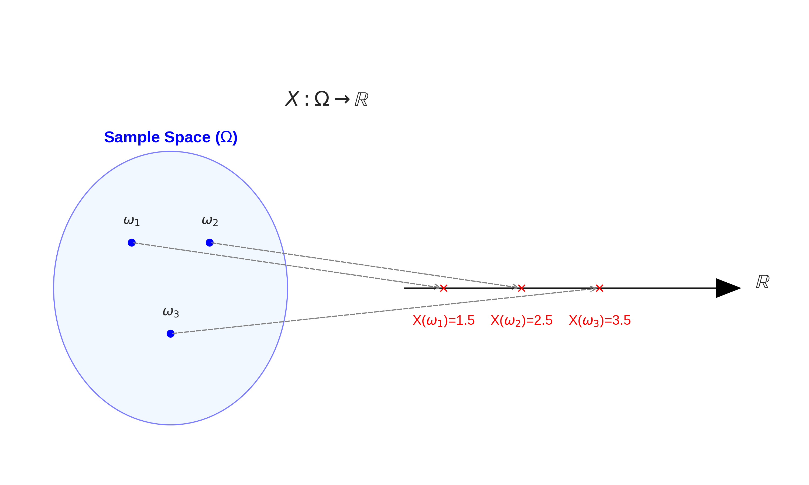

Biến ngẫu nhiên là cầu nối giữa thế giới xác suất trừu tượng và thế giới số liệu cụ thể. Thay vì nói về "biến cố", chúng ta bắt đầu nói về "giá trị" - điều này mở ra cánh cửa cho toàn bộ thống kê và machine learning. Trong bài này, chúng ta sẽ hiểu rõ sự khác biệt giữa biến ngẫu nhiên rời rạc và liên tục, và làm quen với các hàm mô tả chúng: PMF, PDF, và CDF.

---

## Biến Ngẫu Nhiên Là Gì?

**Định nghĩa:**
Một biến ngẫu nhiên (random variable) $$X$$ là một hàm số ánh xạ từ không gian mẫu $$\Omega$$ sang tập số thực $$\mathbb{R}$$.

$$X: \Omega \to \mathbb{R}$$


*Minh họa biến ngẫu nhiên là một hàm ánh xạ từ các kết quả (outcomes) sang số thực.*

Mặc dù có tên là "biến", nhưng thực chất nó là một **hàm số**.

**Ý nghĩa:** Biến ngẫu nhiên gán một giá trị số cho mỗi kết quả của thí nghiệm ngẫu nhiên.

### Ví Dụ Minh Họa

**Thí nghiệm:** Tung 2 đồng xu
- Không gian mẫu: $$\Omega = \{HH, HT, TH, TT\}$$
- Gọi $$X$$ là số mặt ngửa.
  - $$X(HH) = 2$$
  - $$X(HT) = 1$$
  - $$X(TH) = 1$$
  - $$X(TT) = 0$$

```python
import numpy as np
import matplotlib.pyplot as plt
from scipy import stats

def illustrate_random_variable():
    """
    Minh họa khái niệm biến ngẫu nhiên
    """
    # Mô phỏng tung 2 đồng xu nhiều lần
    n_trials = 10000
    
    # Mỗi lần tung: 0=Sấp, 1=Ngửa
    coin1 = np.random.randint(0, 2, n_trials)
    coin2 = np.random.randint(0, 2, n_trials)
    
    # Biến ngẫu nhiên X = số lần ra ngửa
    X = coin1 + coin2
    
    # Đếm tần suất
    values, counts = np.unique(X, return_counts=True)
    frequencies = counts / n_trials
    
    # Xác suất lý thuyết
    theoretical_probs = {0: 1/4, 1: 2/4, 2: 1/4}
    
    # Vẽ biểu đồ
    fig, axes = plt.subplots(1, 2, figsize=(14, 5))
    
    # Không gian mẫu
    outcomes = ['SS', 'SN', 'NS', 'NN']
    x_values = [0, 1, 1, 2]
    axes[0].scatter(range(4), x_values, s=200, alpha=0.6, c='steelblue')
    for i, (outcome, x_val) in enumerate(zip(outcomes, x_values)):
        axes[0].annotate(f'{outcome} → X={x_val}', 
                        xy=(i, x_val), 
                        xytext=(i+0.1, x_val+0.1),
                        fontsize=10)
    axes[0].set_xticks(range(4))
    axes[0].set_xticklabels(outcomes)
    axes[0].set_ylabel('Giá trị của X')
    axes[0].set_title('Biến Ngẫu Nhiên: Ánh Xạ từ Ω → ℝ')
    axes[0].set_ylim(-0.5, 2.5)
    axes[0].grid(True, alpha=0.3, axis='y')
    
    # Phân phối của X
    x_pos = [0, 1, 2]
    axes[1].bar(x_pos, [frequencies[i] if i in values else 0 for i in x_pos], 
                alpha=0.7, label='Thực nghiệm', width=0.4, align='edge')
    axes[1].bar([x + 0.4 for x in x_pos], 
                [theoretical_probs[i] for i in x_pos],
                alpha=0.7, label='Lý thuyết', width=0.4, align='edge')
    axes[1].set_xlabel('Giá trị của X')
    axes[1].set_ylabel('Xác suất')
    axes[1].set_title(f'Phân Phối của X ({n_trials:,} lần thử)')
    axes[1].set_xticks([x + 0.2 for x in x_pos])
    axes[1].set_xticklabels(x_pos)
    axes[1].legend()
    axes[1].grid(True, alpha=0.3, axis='y')
    
    plt.tight_layout()
    # plt.show()
    
    print("Phân phối của X (số lần ra ngửa):")
    for val in x_pos:
        emp = frequencies[np.where(values == val)[0][0]] if val in values else 0
        theo = theoretical_probs[val]
        print(f"  P(X = {val}) = {emp:.4f} (lý thuyết: {theo:.4f})")

# illustrate_random_variable()
```

## Biến Ngẫu Nhiên Rời Rạc (Discrete Random Variables)

**Định nghĩa:** Biến ngẫu nhiên $$X$$ là rời rạc nếu nó chỉ nhận hữu hạn hoặc đếm được các giá trị.

### Probability Mass Function (PMF)

PMF của biến ngẫu nhiên rời rạc $$X$$ là:

$$p_X(x) = P(X = x)$$

**Tính chất:**
1. $$p_X(x) \geq 0$$ với mọi $$x$$
2. $$\sum_{x} p_X(x) = 1$$

```python
def visualize_pmf():
    """
    Visualize PMF của các phân phối rời rạc
    """
    fig, axes = plt.subplots(2, 2, figsize=(14, 10))
    
    # 1. Binomial(n=10, p=0.3)
    n, p = 10, 0.3
    x_binom = np.arange(0, n+1)
    pmf_binom = stats.binom.pmf(x_binom, n, p)
    
    axes[0, 0].stem(x_binom, pmf_binom, basefmt=' ', linefmt='steelblue', markerfmt='o')
    axes[0, 0].set_xlabel('x')
    axes[0, 0].set_ylabel('P(X = x)')
    axes[0, 0].set_title(f'PMF: Binomial(n={n}, p={p})')
    axes[0, 0].grid(True, alpha=0.3)
    
    # 2. Poisson(λ=3)
    lam = 3
    x_pois = np.arange(0, 15)
    pmf_pois = stats.poisson.pmf(x_pois, lam)
    
    axes[0, 1].stem(x_pois, pmf_pois, basefmt=' ', linefmt='coral', markerfmt='o')
    axes[0, 1].set_xlabel('x')
    axes[0, 1].set_ylabel('P(X = x)')
    axes[0, 1].set_title(f'PMF: Poisson(λ={lam})')
    axes[0, 1].grid(True, alpha=0.3)
    
    # 3. Geometric(p=0.3)
    p_geom = 0.3
    x_geom = np.arange(1, 20)
    pmf_geom = stats.geom.pmf(x_geom, p_geom)
    
    axes[1, 0].stem(x_geom, pmf_geom, basefmt=' ', linefmt='green', markerfmt='o')
    axes[1, 0].set_xlabel('x')
    axes[1, 0].set_ylabel('P(X = x)')
    axes[1, 0].set_title(f'PMF: Geometric(p={p_geom})')
    axes[1, 0].grid(True, alpha=0.3)
    
    # 4. Uniform discrete (xúc xắc)
    x_uniform = np.arange(1, 7)
    pmf_uniform = np.ones(6) / 6
    
    axes[1, 1].stem(x_uniform, pmf_uniform, basefmt=' ', linefmt='purple', markerfmt='o')
    axes[1, 1].set_xlabel('x')
    axes[1, 1].set_ylabel('P(X = x)')
    axes[1, 1].set_title('PMF: Discrete Uniform (Xúc xắc)')
    axes[1, 1].grid(True, alpha=0.3)
    
    plt.tight_layout()
    # plt.show()

# visualize_pmf()
```

## Biến Ngẫu Nhiên Liên Tục (Continuous Random Variables)

**Định nghĩa:** Biến ngẫu nhiên $$X$$ là liên tục nếu nó có thể nhận bất kỳ giá trị nào trong một khoảng.

**Lưu ý quan trọng:** Với biến liên tục, $$P(X = x) = 0$$ với mọi $$x$$! Chúng ta chỉ có thể nói về xác suất trong một khoảng.

### Probability Density Function (PDF)

PDF của biến ngẫu nhiên liên tục $$X$$ là hàm $$f_X(x)$$ sao cho:

$$P(a \leq X \leq b) = \int_a^b f_X(x) \, dx$$

**Tính chất:**
1. $$f_X(x) \geq 0$$ với mọi $$x$$
2. $$\int_{-\infty}^{\infty} f_X(x) \, dx = 1$$
3. $$f_X(x)$$ KHÔNG phải là xác suất! Nó có thể lớn hơn 1.

```python
def visualize_pdf():
    """
    Visualize PDF của các phân phối liên tục
    """
    fig, axes = plt.subplots(2, 2, figsize=(14, 10))
    x = np.linspace(-5, 5, 1000)
    
    # 1. Normal(μ=0, σ=1)
    pdf_norm = stats.norm.pdf(x, 0, 1)
    axes[0, 0].plot(x, pdf_norm, linewidth=2, color='steelblue')
    axes[0, 0].fill_between(x, pdf_norm, alpha=0.3)
    
    # Highlight P(-1 ≤ X ≤ 1)
    x_fill = x[(x >= -1) & (x <= 1)]
    axes[0, 0].fill_between(x_fill, stats.norm.pdf(x_fill, 0, 1), 
                             alpha=0.5, color='coral', 
                             label=f'P(-1 ≤ X ≤ 1) = {stats.norm.cdf(1, 0, 1) - stats.norm.cdf(-1, 0, 1):.3f}')
    axes[0, 0].set_xlabel('x')
    axes[0, 0].set_ylabel('f(x)')
    axes[0, 0].set_title('PDF: Normal(μ=0, σ=1)')
    axes[0, 0].legend()
    axes[0, 0].grid(True, alpha=0.3)
    
    # 2. Exponential(λ=1)
    x_exp = np.linspace(0, 5, 1000)
    pdf_exp = stats.expon.pdf(x_exp, scale=1)
    axes[0, 1].plot(x_exp, pdf_exp, linewidth=2, color='coral')
    axes[0, 1].fill_between(x_exp, pdf_exp, alpha=0.3)
    axes[0, 1].set_xlabel('x')
    axes[0, 1].set_ylabel('f(x)')
    axes[0, 1].set_title('PDF: Exponential(λ=1)')
    axes[0, 1].grid(True, alpha=0.3)
    
    # 3. Uniform(a=0, b=1)
    x_unif = np.linspace(-0.5, 1.5, 1000)
    pdf_unif = stats.uniform.pdf(x_unif, 0, 1)
    axes[1, 0].plot(x_unif, pdf_unif, linewidth=2, color='green')
    axes[1, 0].fill_between(x_unif, pdf_unif, alpha=0.3)
    axes[1, 0].set_xlabel('x')
    axes[1, 0].set_ylabel('f(x)')
    axes[1, 0].set_title('PDF: Uniform(0, 1)')
    axes[1, 0].grid(True, alpha=0.3)
    
    # 4. Beta(α=2, β=5)
    x_beta = np.linspace(0, 1, 1000)
    pdf_beta = stats.beta.pdf(x_beta, 2, 5)
    axes[1, 1].plot(x_beta, pdf_beta, linewidth=2, color='purple')
    axes[1, 1].fill_between(x_beta, pdf_beta, alpha=0.3)
    axes[1, 1].set_xlabel('x')
    axes[1, 1].set_ylabel('f(x)')
    axes[1, 1].set_title('PDF: Beta(α=2, β=5)')
    axes[1, 1].grid(True, alpha=0.3)
    
    plt.tight_layout()
    # plt.show()

# visualize_pdf()
```

### Mô Phỏng: Verify Tính Chất của PDF

```python
def verify_pdf_properties():
    """
    Verify rằng P(X = x) = 0 cho biến liên tục
    """
    # Sample từ phân phối chuẩn
    n_samples = 1000000
    X = np.random.normal(0, 1, n_samples)
    
    # Kiểm tra P(X = 0)
    epsilon_values = [0.1, 0.01, 0.001, 0.0001]
    
    print("Verify P(X = x) = 0 cho biến liên tục:")
    print("=" * 60)
    print(f"Sinh {n_samples:,} mẫu từ N(0, 1)")
    print()
    
    for eps in epsilon_values:
        # P(|X - 0| < ε)
        prob = np.sum(np.abs(X) < eps) / n_samples
        # Lý thuyết: P(|X| < ε) = 2 * Φ(ε) - 1
        prob_theory = 2 * stats.norm.cdf(eps, 0, 1) - 1
        
        print(f"ε = {eps:.4f}:")
        print(f"  P(|X - 0| < {eps}) ≈ {prob:.6f} (lý thuyết: {prob_theory:.6f})")
        print(f"  Khi ε → 0, xác suất → 0")
        print()
    
    print("Kết luận: P(X = 0) = lim(ε→0) P(|X| < ε) = 0")
    print("Đối với biến liên tục, chỉ có ý nghĩa nói về P(a ≤ X ≤ b)")

# verify_pdf_properties()
```

## Cumulative Distribution Function (CDF)

CDF là hàm phân phối tích lũy, định nghĩa cho cả biến rời rạc và liên tục:

$$F_X(x) = P(X \leq x)$$

**Tính chất:**
1. $$0 \leq F_X(x) \leq 1$$
2. $$F_X(x)$$ là hàm không giảm
3. $$\lim_{x \to -\infty} F_X(x) = 0$$ và $$\lim_{x \to \infty} F_X(x) = 1$$
4. $$F_X(x)$$ liên tục phải

**Mối quan hệ với PMF/PDF:**
- Rời rạc: $$F_X(x) = \sum_{t \leq x} p_X(t)$$
- Liên tục: $$F_X(x) = \int_{-\infty}^x f_X(t) \, dt$$ và $$f_X(x) = \frac{d}{dx} F_X(x)$$

```python
def compare_pmf_pdf_cdf():
    """
    So sánh PMF/PDF và CDF
    """
    fig, axes = plt.subplots(2, 3, figsize=(16, 10))
    
    # === Biến rời rạc: Binomial ===
    n, p = 10, 0.4
    x_discrete = np.arange(0, n+1)
    pmf = stats.binom.pmf(x_discrete, n, p)
    cdf_discrete = stats.binom.cdf(x_discrete, n, p)
    
    # PMF
    axes[0, 0].stem(x_discrete, pmf, basefmt=' ', linefmt='steelblue', markerfmt='o')
    axes[0, 0].set_xlabel('x')
    axes[0, 0].set_ylabel('P(X = x)')
    axes[0, 0].set_title('PMF: Binomial(10, 0.4)')
    axes[0, 0].grid(True, alpha=0.3)
    
    # CDF (rời rạc)
    axes[0, 1].step(x_discrete, cdf_discrete, where='post', linewidth=2, color='steelblue')
    axes[0, 1].scatter(x_discrete, cdf_discrete, s=50, zorder=5)
    axes[0, 1].set_xlabel('x')
    axes[0, 1].set_ylabel('P(X ≤ x)')
    axes[0, 1].set_title('CDF: Binomial(10, 0.4)')
    axes[0, 1].grid(True, alpha=0.3)
    
    # Mô phỏng
    samples_discrete = np.random.binomial(n, p, 10000)
    axes[0, 2].hist(samples_discrete, bins=np.arange(-0.5, n+1.5, 1), 
                    density=True, alpha=0.7, edgecolor='black')
    axes[0, 2].plot(x_discrete, pmf, 'ro-', linewidth=2, markersize=8, label='PMF lý thuyết')
    axes[0, 2].set_xlabel('x')
    axes[0, 2].set_ylabel('Density')
    axes[0, 2].set_title('Mô phỏng: 10,000 mẫu')
    axes[0, 2].legend()
    axes[0, 2].grid(True, alpha=0.3)
    
    # === Biến liên tục: Normal ===
    x_continuous = np.linspace(-4, 4, 1000)
    pdf = stats.norm.pdf(x_continuous, 0, 1)
    cdf_continuous = stats.norm.cdf(x_continuous, 0, 1)
    
    # PDF
    axes[1, 0].plot(x_continuous, pdf, linewidth=2, color='coral')
    axes[1, 0].fill_between(x_continuous, pdf, alpha=0.3)
    axes[1, 0].set_xlabel('x')
    axes[1, 0].set_ylabel('f(x)')
    axes[1, 0].set_title('PDF: Normal(0, 1)')
    axes[1, 0].grid(True, alpha=0.3)
    
    # CDF (liên tục)
    axes[1, 1].plot(x_continuous, cdf_continuous, linewidth=2, color='coral')
    axes[1, 1].set_xlabel('x')
    axes[1, 1].set_ylabel('P(X ≤ x)')
    axes[1, 1].set_title('CDF: Normal(0, 1)')
    axes[1, 1].grid(True, alpha=0.3)
    
    # Mô phỏng
    samples_continuous = np.random.normal(0, 1, 10000)
    axes[1, 2].hist(samples_continuous, bins=50, density=True, alpha=0.7, edgecolor='black')
    axes[1, 2].plot(x_continuous, pdf, 'r-', linewidth=2, label='PDF lý thuyết')
    axes[1, 2].set_xlabel('x')
    axes[1, 2].set_ylabel('Density')
    axes[1, 2].set_title('Mô phỏng: 10,000 mẫu')
    axes[1, 2].legend()
    axes[1, 2].grid(True, alpha=0.3)
    
    plt.tight_layout()
    # plt.show()

# compare_pmf_pdf_cdf()
```

## Ứng Dụng: Tính Xác Suất với CDF

CDF rất hữu ích để tính xác suất:

$$P(a < X \leq b) = F_X(b) - F_X(a)$$

```python
def probability_calculations_with_cdf():
    """
    Minh họa cách tính xác suất bằng CDF
    """
    # Phân phối chuẩn N(100, 15)
    mu, sigma = 100, 15
    
    # Câu hỏi: Tính P(85 < X ≤ 115)
    a, b = 85, 115
    
    # Phương pháp 1: Dùng CDF
    prob_cdf = stats.norm.cdf(b, mu, sigma) - stats.norm.cdf(a, mu, sigma)
    
    # Phương pháp 2: Mô phỏng
    n_samples = 100000
    X = np.random.normal(mu, sigma, n_samples)
    prob_sim = np.sum((X > a) & (X <= b)) / n_samples
    
    # Phương pháp 3: Tích phân PDF
    from scipy.integrate import quad
    pdf = lambda x: stats.norm.pdf(x, mu, sigma)
    prob_integral, _ = quad(pdf, a, b)
    
    # Visualize
    x = np.linspace(mu - 4*sigma, mu + 4*sigma, 1000)
    pdf_values = stats.norm.pdf(x, mu, sigma)
    cdf_values = stats.norm.cdf(x, mu, sigma)
    
    fig, axes = plt.subplots(1, 2, figsize=(14, 5))
    
    # PDF với vùng tô màu
    axes[0].plot(x, pdf_values, linewidth=2, color='steelblue', label='PDF')
    x_fill = x[(x > a) & (x <= b)]
    axes[0].fill_between(x_fill, stats.norm.pdf(x_fill, mu, sigma), 
                         alpha=0.5, color='coral', label=f'P({a} < X ≤ {b})')
    axes[0].axvline(a, color='red', linestyle='--', alpha=0.7)
    axes[0].axvline(b, color='red', linestyle='--', alpha=0.7)
    axes[0].set_xlabel('x')
    axes[0].set_ylabel('f(x)')
    axes[0].set_title(f'PDF: N({mu}, {sigma}²)')
    axes[0].legend()
    axes[0].grid(True, alpha=0.3)
    
    # CDF với điểm đánh dấu
    axes[1].plot(x, cdf_values, linewidth=2, color='steelblue', label='CDF')
    axes[1].scatter([a, b], [stats.norm.cdf(a, mu, sigma), stats.norm.cdf(b, mu, sigma)],
                   s=100, c='red', zorder=5)
    axes[1].axhline(stats.norm.cdf(a, mu, sigma), color='red', linestyle='--', alpha=0.5)
    axes[1].axhline(stats.norm.cdf(b, mu, sigma), color='red', linestyle='--', alpha=0.5)
    axes[1].axvline(a, color='red', linestyle='--', alpha=0.5)
    axes[1].axvline(b, color='red', linestyle='--', alpha=0.5)
    
    # Annotate
    axes[1].annotate(f'F({b}) = {stats.norm.cdf(b, mu, sigma):.3f}',
                    xy=(b, stats.norm.cdf(b, mu, sigma)),
                    xytext=(b+5, stats.norm.cdf(b, mu, sigma)+0.1),
                    arrowprops=dict(arrowstyle='->', color='red'))
    axes[1].annotate(f'F({a}) = {stats.norm.cdf(a, mu, sigma):.3f}',
                    xy=(a, stats.norm.cdf(a, mu, sigma)),
                    xytext=(a-15, stats.norm.cdf(a, mu, sigma)-0.15),
                    arrowprops=dict(arrowstyle='->', color='red'))
    
    axes[1].set_xlabel('x')
    axes[1].set_ylabel('F(x)')
    axes[1].set_title(f'CDF: N({mu}, {sigma}²)')
    axes[1].legend()
    axes[1].grid(True, alpha=0.3)
    
    plt.tight_layout()
    # plt.show()
    
    print(f"Tính P({a} < X ≤ {b}) với X ~ N({mu}, {sigma}²):")
    print("=" * 60)
    print(f"Phương pháp 1 (CDF):       {prob_cdf:.6f}")
    print(f"Phương pháp 2 (Mô phỏng):  {prob_sim:.6f}")
    print(f"Phương pháp 3 (Tích phân): {prob_integral:.6f}")
    print()
    print(f"F({b}) - F({a}) = {stats.norm.cdf(b, mu, sigma):.6f} - {stats.norm.cdf(a, mu, sigma):.6f} = {prob_cdf:.6f}")

# probability_calculations_with_cdf()
```

## Bài Tập Thực Hành

**Bài 1: Tạo Biến Ngẫu Nhiên Tùy Chỉnh**
Tạo một biến ngẫu nhiên rời rạc với PMF:
- P(X = 0) = 0.2
- P(X = 1) = 0.3
- P(X = 2) = 0.5

Viết hàm để:
- Sample từ phân phối này
- Tính CDF
- Verify bằng mô phỏng

**Bài 2: Phân Tích PDF**
Cho PDF: $$f(x) = 2x$$ với $$0 \leq x \leq 1$$
- Verify rằng $$\int_0^1 f(x) dx = 1$$
- Tính CDF $$F(x)$$
- Tính $$P(0.25 < X < 0.75)$$
- Mô phỏng và so sánh

**Bài 3: Quantile Function**
CDF có hàm nghịch đảo gọi là quantile function: $$F^{-1}(p)$$
- Tính median (p=0.5), Q1 (p=0.25), Q3 (p=0.75) của N(0,1)
- Verify bằng mô phỏng
- Vẽ biểu đồ CDF và đánh dấu các quantiles

**Bài 4: Transformation**
Nếu $$X \sim \text{Uniform}(0, 1)$$, tìm phân phối của $$Y = -\ln(X)$$
- Tính PDF của Y bằng lý thuyết
- Verify bằng mô phỏng
- Hint: Đây là phân phối Exponential!
