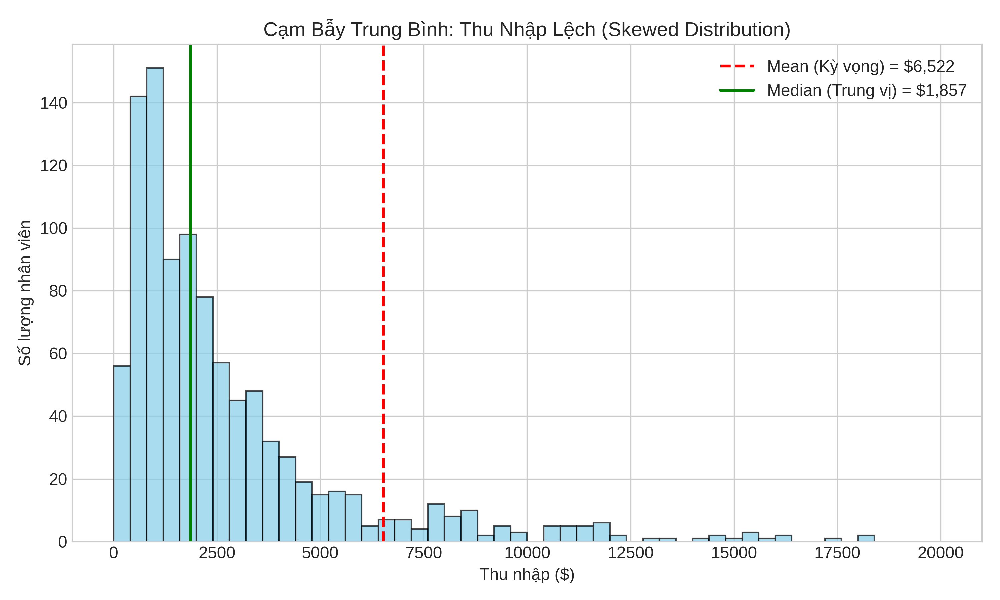

Nếu biến ngẫu nhiên mô tả "những gì có thể xảy ra", thì kỳ vọng và phương sai mô tả "trung bình sẽ như thế nào" và "mức độ biến động ra sao". Hai khái niệm này là nền tảng cho toàn bộ thống kê - từ ước lượng tham số đến kiểm định giả thuyết. Trong bài này, chúng ta không chỉ học công thức mà còn hiểu sâu ý nghĩa và các tính chất quan trọng thông qua mô phỏng.

---

## Kỳ Vọng (Expected Value)

**Định nghĩa:** Kỳ vọng (hay giá trị trung bình) của biến ngẫu nhiên $$X$$ là:

**Rời rạc:**
$$E[X] = \sum_x x \cdot P(X = x) = \sum_x x \cdot p_X(x)$$

**Liên tục:**
$$E[X] = \int_{-\infty}^{\infty} x \cdot f_X(x) \, dx$$

**Ký hiệu:** $$E[X] = \mu = \mu_X$$

### Ý Nghĩa Trực Quan

Kỳ vọng là "trung tâm khối lượng" của phân phối - điểm cân bằng nếu ta đặt phân phối lên một thanh gỗ.

```python
import numpy as np
import matplotlib.pyplot as plt
from scipy import stats

def visualize_expectation():
    """
    Minh họa kỳ vọng như trung tâm khối lượng
    """
    fig, axes = plt.subplots(1, 2, figsize=(14, 5))
    
    # Phân phối rời rạc
    x_discrete = np.array([1, 2, 3, 4, 5, 6])
    pmf = np.array([0.1, 0.15, 0.25, 0.25, 0.15, 0.1])
    expected_value = np.sum(x_discrete * pmf)
    
    axes[0].stem(x_discrete, pmf, basefmt=' ', linefmt='steelblue', markerfmt='o')
    axes[0].axvline(expected_value, color='red', linestyle='--', linewidth=2, 
                   label=f'E[X] = {expected_value:.2f}')
    axes[0].set_xlabel('x')
    axes[0].set_ylabel('P(X = x)')
    axes[0].set_title('Kỳ Vọng của Phân Phối Rời Rạc')
    axes[0].legend()
    axes[0].grid(True, alpha=0.3)
    
    # Phân phối liên tục (Beta skewed)
    x_continuous = np.linspace(0, 1, 1000)
    pdf = stats.beta.pdf(x_continuous, 2, 5)
    expected_value_cont = 2 / (2 + 5)  # E[Beta(α,β)] = α/(α+β)
    
    axes[1].plot(x_continuous, pdf, linewidth=2, color='steelblue')
    axes[1].fill_between(x_continuous, pdf, alpha=0.3)
    axes[1].axvline(expected_value_cont, color='red', linestyle='--', linewidth=2,
                   label=f'E[X] = {expected_value_cont:.3f}')
    axes[1].set_xlabel('x')
    axes[1].set_ylabel('f(x)')
    axes[1].set_title('Kỳ Vọng của Phân Phối Liên Tục (Beta)')
    axes[1].legend()
    axes[1].grid(True, alpha=0.3)
    
    plt.tight_layout()
    # plt.show()

# visualize_expectation()
```

## Cạm Bẫy Trung Bình (The Average Trap)

> *"The well-wrapped average."* - Darrell Huff, *How to Lie with Statistics*

Kỳ vọng (Mean) là thước đo quan trọng, nhưng đôi khi nó **đánh lừa** chúng ta, đặc biệt khi dữ liệu có phân phối lệch (skewed) hoặc có outliers.

### Ví Dụ: Mức Lương "Trung Bình"
Sếp tuyên bố: "Lương trung bình ở công ty ta là $5,000/tháng! Rất cao!"
Nhân viên thắc mắc: "Sao tôi và mọi người chỉ nhận được $2,000?"

Sự thật:
- Sếp: $100,000 (1 người)
- Nhân viên: $2,000 (30 người)

$$Mean = \frac{100,000 + 30 \times 2,000}{31} \approx 5,161$$

Trong trường hợp này, **Median** (Trung vị) phản ánh đúng thực tế hơn ($2,000).

*   **Mean:** Nhạy cảm với outliers (kéo về phía đuôi dài).
*   **Median:** Ít bị ảnh hưởng bởi outliers (robust).


*Phân phối thu nhập lệch phải (Right-skewed): Mean bị kéo về phía các giá trị cực lớn (lương sếp), trong khi Median phản ánh tốt hơn thu nhập của đa số.*

```python
def average_trap_demo():
    """
    Minh họa Mean vs Median trong phân phối thu nhập (skewed)
    """
    # Tạo phân phối thu nhập: Đa số thấp, một số ít cực cao
    np.random.seed(42)
    n_employees = 1000
    
    # Lognormal distribution thường dùng để mô phỏng thu nhập
    incomes = np.random.lognormal(mean=7.5, sigma=1.0, size=n_employees)
    
    # Thêm vài 'sếp' lương khủng
    bosses = np.array([50000, 100000, 200000]) * 10
    incomes = np.concatenate([incomes, bosses])
    
    mean_val = np.mean(incomes)
    median_val = np.median(incomes)
    
    plt.figure(figsize=(10, 6))
    plt.hist(incomes, bins=50, range=(0, 20000), alpha=0.7, color='skyblue', edgecolor='black')
    plt.axvline(mean_val, color='red', linestyle='--', linewidth=2, label=f'Mean (Kỳ vọng) = ${mean_val:,.0f}')
    plt.axvline(median_val, color='green', linestyle='-', linewidth=2, label=f'Median (Trung vị) = ${median_val:,.0f}')
    
    plt.xlabel('Thu nhập')
    plt.ylabel('Số lượng nhân viên')
    plt.title('Cạm Bẫy Trung Bình: Thu Nhập Tại Công Ty')
    plt.legend()
    plt.grid(True, alpha=0.3)
    # plt.show()
    
    print("So sánh Mean và Median:")
    print("=" * 40)
    print(f"Mean Income:   ${mean_val:,.2f} (Bị kéo bởi sếp)")
    print(f"Median Income: ${median_val:,.2f} (Phản ánh đại đa số)")
    print(f"Chênh lệch:    {mean_val/median_val:.1f} lần!")

# average_trap_demo()
```

### Verify Bằng Mô Phỏng

```python
def verify_expectation_by_simulation():
    """
    Verify định nghĩa kỳ vọng bằng Luật Số Lớn
    """
    # Phân phối: Binomial(n=10, p=0.3)
    n, p = 10, 0.3
    expected_theoretical = n * p  # E[Binomial] = np
    
    # Mô phỏng
    n_simulations = [10, 100, 1000, 10000, 100000]
    sample_means = []
    
    for n_sim in n_simulations:
        samples = np.random.binomial(n, p, n_sim)
        sample_means.append(samples.mean())
    
    # Vẽ biểu đồ
    plt.figure(figsize=(12, 5))
    
    plt.subplot(1, 2, 1)
    plt.semilogx(n_simulations, sample_means, 'o-', linewidth=2, markersize=8, label='Sample mean')
    plt.axhline(expected_theoretical, color='red', linestyle='--', linewidth=2, label=f'E[X] = {expected_theoretical}')
    plt.xlabel('Số lần mô phỏng')
    plt.ylabel('Sample mean')
    plt.title('Luật Số Lớn: Sample Mean → E[X]')
    plt.legend()
    plt.grid(True, alpha=0.3)
    
    # Histogram với nhiều mẫu
    samples_large = np.random.binomial(n, p, 100000)
    plt.subplot(1, 2, 2)
    plt.hist(samples_large, bins=np.arange(-0.5, n+1.5, 1), density=True, alpha=0.7, edgecolor='black')
    plt.axvline(samples_large.mean(), color='blue', linestyle='-', linewidth=2, label=f'Sample mean = {samples_large.mean():.3f}')
    plt.axvline(expected_theoretical, color='red', linestyle='--', linewidth=2, label=f'E[X] = {expected_theoretical}')
    plt.xlabel('x')
    plt.ylabel('Density')
    plt.title(f'Phân phối với {len(samples_large):,} mẫu')
    plt.legend()
    plt.grid(True, alpha=0.3)
    
    plt.tight_layout()
    # plt.show()
    
    print("Verify E[X] bằng mô phỏng:")
    print("=" * 50)
    print(f"Phân phối: Binomial(n={n}, p={p})")
    print(f"E[X] lý thuyết = np = {expected_theoretical}")
    print()
    for n_sim, mean in zip(n_simulations, sample_means):
        print(f"  n={n_sim:6d}: Sample mean = {mean:.4f}")

# verify_expectation_by_simulation()
```

## Tính Chất của Kỳ Vọng

### 1. Tính Tuyến Tính (Linearity)

$$E[aX + b] = aE[X] + b$$

$$E[X + Y] = E[X] + E[Y]$$ (luôn đúng, không cần độc lập!)

```python
def verify_linearity():
    """
    Verify tính tuyến tính của kỳ vọng
    """
    n_samples = 100000
    
    # Tạo hai biến ngẫu nhiên PHỤ THUỘC
    X = np.random.normal(0, 1, n_samples)
    Y = 2*X + np.random.normal(0, 0.5, n_samples)  # Y phụ thuộc vào X!
    
    # Tính kỳ vọng
    a, b = 3, 5
    
    # E[aX + b]
    lhs1 = (a*X + b).mean()
    rhs1 = a * X.mean() + b
    
    # E[X + Y]
    lhs2 = (X + Y).mean()
    rhs2 = X.mean() + Y.mean()
    
    print("Verify Tính Tuyến Tính của Kỳ Vọng:")
    print("=" * 60)
    print(f"Với a={a}, b={b}")
    print()
    print(f"E[{a}X + {b}] = {lhs1:.6f}")
    print(f"{a}E[X] + {b} = {rhs1:.6f}")
    print(f"Sai số: {abs(lhs1 - rhs1):.8f}")
    print()
    print(f"E[X + Y] = {lhs2:.6f}")
    print(f"E[X] + E[Y] = {rhs2:.6f}")
    print(f"Sai số: {abs(lhs2 - rhs2):.8f}")
    print()
    print("⚠️  Lưu ý: E[X + Y] = E[X] + E[Y] ngay cả khi X và Y PHỤ THUỘC!")

# verify_linearity()
```

### 2. Law of the Unconscious Statistician (LOTUS)

Nếu $$Y = g(X)$$, thì:

**Rời rạc:** $$E[g(X)] = \sum_x g(x) \cdot p_X(x)$$

**Liên tục:** $$E[g(X)] = \int_{-\infty}^{\infty} g(x) \cdot f_X(x) \, dx$$

**Ý nghĩa:** Không cần tìm phân phối của $$Y$$, chỉ cần dùng phân phối của $$X$$!

```python
def demonstrate_lotus():
    """
    Minh họa LOTUS
    """
    # X ~ Uniform(0, 1)
    # Tính E[X²]
    
    # Phương pháp 1: LOTUS - dùng phân phối của X
    from scipy.integrate import quad
    f_x = lambda x: 1  # PDF của Uniform(0,1)
    g = lambda x: x**2
    expected_lotus, _ = quad(lambda x: g(x) * f_x(x), 0, 1)
    
    # Phương pháp 2: Mô phỏng
    n_samples = 100000
    X = np.random.uniform(0, 1, n_samples)
    Y = X**2
    expected_sim = Y.mean()
    
    # Phương pháp 3: Lý thuyết
    # E[X²] cho Uniform(0,1) = 1/3
    expected_theory = 1/3
    
    print("LOTUS: Tính E[g(X)] mà không cần phân phối của g(X)")
    print("=" * 60)
    print("X ~ Uniform(0, 1), g(X) = X²")
    print()
    print(f"E[X²] bằng LOTUS (tích phân):  {expected_lotus:.6f}")
    print(f"E[X²] bằng mô phỏng:           {expected_sim:.6f}")
    print(f"E[X²] lý thuyết:               {expected_theory:.6f}")
    
    # Visualize
    x = np.linspace(0, 1, 1000)
    plt.figure(figsize=(12, 5))
    
    plt.subplot(1, 2, 1)
    plt.plot(x, np.ones_like(x), linewidth=2, label='f(x) = 1')
    plt.fill_between(x, np.ones_like(x), alpha=0.3)
    plt.xlabel('x')
    plt.ylabel('f(x)')
    plt.title('PDF của X ~ Uniform(0, 1)')
    plt.legend()
    plt.grid(True, alpha=0.3)
    
    plt.subplot(1, 2, 2)
    plt.hist(Y, bins=50, density=True, alpha=0.7, edgecolor='black', label='Histogram của Y=X²')
    plt.axvline(expected_sim, color='red', linestyle='--', linewidth=2, label=f'E[Y] = {expected_sim:.3f}')
    plt.xlabel('y')
    plt.ylabel('Density')
    plt.title('Phân phối của Y = X²')
    plt.legend()
    plt.grid(True, alpha=0.3)
    
    plt.tight_layout()
    # plt.show()

# demonstrate_lotus()
```

## Phương Sai (Variance)

**Định nghĩa:** Phương sai đo lường mức độ phân tán của biến ngẫu nhiên xung quanh kỳ vọng:

$$\text{Var}(X) = E[(X - \mu)^2] = E[X^2] - (E[X])^2$$

**Độ lệch chuẩn:** $$\sigma = \sqrt{\text{Var}(X)}$$

**Ký hiệu:** $$\text{Var}(X) = \sigma^2 = \sigma_X^2$$

```python
def visualize_variance():
    """
    Minh họa ý nghĩa của phương sai
    """
    # Hai phân phối cùng kỳ vọng nhưng khác phương sai
    mu = 0
    sigma1, sigma2 = 0.5, 2
    
    x = np.linspace(-6, 6, 1000)
    pdf1 = stats.norm.pdf(x, mu, sigma1)
    pdf2 = stats.norm.pdf(x, mu, sigma2)
    
    plt.figure(figsize=(12, 5))
    
    plt.subplot(1, 2, 1)
    plt.plot(x, pdf1, linewidth=2, label=f'σ = {sigma1} (Var = {sigma1**2})')
    plt.plot(x, pdf2, linewidth=2, label=f'σ = {sigma2} (Var = {sigma2**2})')
    plt.axvline(mu, color='red', linestyle='--', alpha=0.5, label=f'E[X] = {mu}')
    plt.xlabel('x')
    plt.ylabel('f(x)')
    plt.title('Cùng Kỳ Vọng, Khác Phương Sai')
    plt.legend()
    plt.grid(True, alpha=0.3)
    
    # Mô phỏng
    n_samples = 10000
    samples1 = np.random.normal(mu, sigma1, n_samples)
    samples2 = np.random.normal(mu, sigma2, n_samples)
    
    plt.subplot(1, 2, 2)
    plt.hist(samples1, bins=50, density=True, alpha=0.5, label=f'σ = {sigma1}', edgecolor='black')
    plt.hist(samples2, bins=50, density=True, alpha=0.5, label=f'σ = {sigma2}', edgecolor='black')
    plt.axvline(mu, color='red', linestyle='--', linewidth=2, label=f'E[X] = {mu}')
    plt.xlabel('x')
    plt.ylabel('Density')
    plt.title(f'Histogram ({n_samples:,} mẫu)')
    plt.legend()
    plt.grid(True, alpha=0.3)
    
    plt.tight_layout()
    # plt.show()
    
    print("Phương sai đo mức độ phân tán:")
    print("=" * 50)
    print(f"Phân phối 1: E[X] = {samples1.mean():.4f}, Var(X) = {samples1.var():.4f}")
    print(f"Phân phối 2: E[X] = {samples2.mean():.4f}, Var(X) = {samples2.var():.4f}")

# visualize_variance()
```

## Tính Chất của Phương Sai

### 1. Công Thức Tính Nhanh

$$\text{Var}(X) = E[X^2] - (E[X])^2$$

Công thức này thường dễ tính hơn định nghĩa!

### 2. Biến Đổi Tuyến Tính

$$\text{Var}(aX + b) = a^2 \text{Var}(X)$$

**Lưu ý:** Hằng số $$b$$ không ảnh hưởng đến phương sai!

### 3. Tổng Các Biến Độc Lập

Nếu $$X$$ và $$Y$$ **độc lập**:

$$\text{Var}(X + Y) = \text{Var}(X) + \text{Var}(Y)$$

**Cảnh báo:** Điều này KHÔNG đúng nếu $$X$$ và $$Y$$ phụ thuộc!

```python
def verify_variance_properties():
    """
    Verify các tính chất của phương sai
    """
    n_samples = 100000
    
    # Tạo biến ngẫu nhiên
    X = np.random.normal(5, 2, n_samples)  # E[X]=5, Var(X)=4
    
    a, b = 3, 10
    
    # Tính chất 1: Var(aX + b) = a² Var(X)
    Y = a*X + b
    var_y_empirical = Y.var()
    var_y_theoretical = a**2 * X.var()
    
    print("Tính Chất của Phương Sai:")
    print("=" * 60)
    print(f"X ~ N(5, 4), a={a}, b={b}")
    print()
    print(f"Var({a}X + {b}) empirical:  {var_y_empirical:.4f}")
    print(f"{a}² × Var(X) theoretical: {var_y_theoretical:.4f}")
    print()
    
    # Tính chất 2: Var(X + Y) cho biến độc lập vs phụ thuộc
    # Độc lập
    Z_indep = np.random.normal(3, 1.5, n_samples)  # Độc lập với X
    var_sum_indep = (X + Z_indep).var()
    var_sum_theory_indep = X.var() + Z_indep.var()
    
    # Phụ thuộc
    Z_dep = 2*X + np.random.normal(0, 0.5, n_samples)  # Phụ thuộc vào X
    var_sum_dep = (X + Z_dep).var()
    var_sum_theory_wrong = X.var() + Z_dep.var()  # Công thức SAI!
    
    print("Var(X + Z) khi X và Z độc lập:")
    print(f"  Var(X + Z) empirical:  {var_sum_indep:.4f}")
    print(f"  Var(X) + Var(Z):       {var_sum_theory_indep:.4f}")
    print()
    print("Var(X + Z) khi X và Z PHỤ THUỘC:")
    print(f"  Var(X + Z) empirical:  {var_sum_dep:.4f}")
    print(f"  Var(X) + Var(Z):       {var_sum_theory_wrong:.4f} ❌ SAI!")
    print()
    print("⚠️  Var(X + Y) = Var(X) + Var(Y) CHỈ đúng khi X và Y độc lập!")

# verify_variance_properties()
```

## Covariance và Correlation

### Covariance

$$\text{Cov}(X, Y) = E[(X - E[X])(Y - E[Y])] = E[XY] - E[X]E[Y]$$

**Ý nghĩa:**
- $$\text{Cov}(X, Y) > 0$$: X và Y cùng tăng/giảm
- $$\text{Cov}(X, Y) < 0$$: X tăng thì Y giảm và ngược lại
- $$\text{Cov}(X, Y) = 0$$: Không có mối quan hệ tuyến tính (nhưng có thể có quan hệ phi tuyến!)

**Tính chất:** Nếu $$X$$ và $$Y$$ độc lập, thì $$\text{Cov}(X, Y) = 0$$ (nhưng chiều ngược lại KHÔNG đúng!)

### Correlation

$$\rho_{X,Y} = \text{Corr}(X, Y) = \frac{\text{Cov}(X, Y)}{\sigma_X \sigma_Y}$$

**Tính chất:** $$-1 \leq \rho \leq 1$$

```python
def visualize_correlation():
    """
    Minh họa correlation với các mức độ khác nhau
    """
    n_samples = 1000
    
    # Tạo dữ liệu với correlation khác nhau
    correlations = [0.9, 0.5, 0, -0.5, -0.9]
    
    fig, axes = plt.subplots(1, 5, figsize=(18, 3))
    
    for i, rho in enumerate(correlations):
        # Tạo dữ liệu với correlation rho
        mean = [0, 0]
        cov = [[1, rho], [rho, 1]]
        X, Y = np.random.multivariate_normal(mean, cov, n_samples).T
        
        # Tính correlation empirical
        rho_empirical = np.corrcoef(X, Y)[0, 1]
        
        axes[i].scatter(X, Y, alpha=0.5, s=10)
        axes[i].set_xlabel('X')
        axes[i].set_ylabel('Y')
        axes[i].set_title(f'ρ = {rho}\n(empirical: {rho_empirical:.3f})')
        axes[i].grid(True, alpha=0.3)
        axes[i].set_xlim(-3, 3)
        axes[i].set_ylim(-3, 3)
    
    plt.tight_layout()
    # plt.show()

# visualize_correlation()
```

### Cảnh Báo: Correlation ≠ Causation

```python
def correlation_not_causation():
    """
    Minh họa: Correlation không có nghĩa là causation
    """
    n = 1000
    
    # Biến ẩn: Nhiệt độ
    temperature = np.random.uniform(15, 35, n)
    
    # Ice cream sales phụ thuộc vào nhiệt độ
    ice_cream = 100 + 10 * temperature + np.random.normal(0, 20, n)
    
    # Drowning incidents cũng phụ thuộc vào nhiệt độ
    drowning = 5 + 0.5 * temperature + np.random.normal(0, 2, n)
    
    # Tính correlation
    corr_ice_drowning = np.corrcoef(ice_cream, drowning)[0, 1]
    
    fig, axes = plt.subplots(1, 3, figsize=(16, 4))
    
    # Ice cream vs Drowning (có correlation!)
    axes[0].scatter(ice_cream, drowning, alpha=0.5, s=20)
    axes[0].set_xlabel('Ice Cream Sales')
    axes[0].set_ylabel('Drowning Incidents')
    axes[0].set_title(f'Correlation = {corr_ice_drowning:.3f}\n⚠️ Nhưng KHÔNG có causation!')
    axes[0].grid(True, alpha=0.3)
    
    # Temperature vs Ice cream
    axes[1].scatter(temperature, ice_cream, alpha=0.5, s=20, color='coral')
    axes[1].set_xlabel('Temperature')
    axes[1].set_ylabel('Ice Cream Sales')
    axes[1].set_title('Nhiệt độ → Ice Cream\n(Causation thực sự)')
    axes[1].grid(True, alpha=0.3)
    
    # Temperature vs Drowning
    axes[2].scatter(temperature, drowning, alpha=0.5, s=20, color='green')
    axes[2].set_xlabel('Temperature')
    axes[2].set_ylabel('Drowning Incidents')
    axes[2].set_title('Nhiệt độ → Drowning\n(Causation thực sự)')
    axes[2].grid(True, alpha=0.3)
    
    plt.tight_layout()
    # plt.show()
    
    print("Ví Dụ: Correlation ≠ Causation")
    print("=" * 60)
    print(f"Correlation(Ice Cream, Drowning) = {corr_ice_drowning:.3f}")
    print()
    print("Kết luận SAI: Ice cream gây ra đuối nước!")
    print("Kết luận ĐÚNG: Cả hai đều do nhiệt độ cao (confounding variable)")

# correlation_not_causation()
```

## Bài Tập Thực Hành

**Bài 1: Tính Kỳ Vọng và Phương Sai**
Cho biến ngẫu nhiên rời rạc với PMF:
- P(X = -1) = 0.2
- P(X = 0) = 0.5
- P(X = 2) = 0.3

Tính E[X], Var(X), E[X²], E[3X + 5]. Verify bằng mô phỏng.

**Bài 2: LOTUS**
Cho X ~ Uniform(0, 2). Tính E[X³] bằng:
- LOTUS (tích phân)
- Mô phỏng
- So sánh kết quả

**Bài 3: Portfolio Variance**
Bạn đầu tư 50% vào cổ phiếu A (σ_A = 20%) và 50% vào cổ phiếu B (σ_B = 30%).
- Nếu A và B độc lập, tính phương sai của portfolio
- Nếu Corr(A, B) = 0.5, tính lại
- Mô phỏng để verify

**Bài 4: Anscombe's Quartet**
Tìm hiểu về Anscombe's Quartet - 4 datasets có cùng mean, variance, và correlation nhưng hoàn toàn khác nhau khi visualize. Tạo lại và vẽ biểu đồ.
