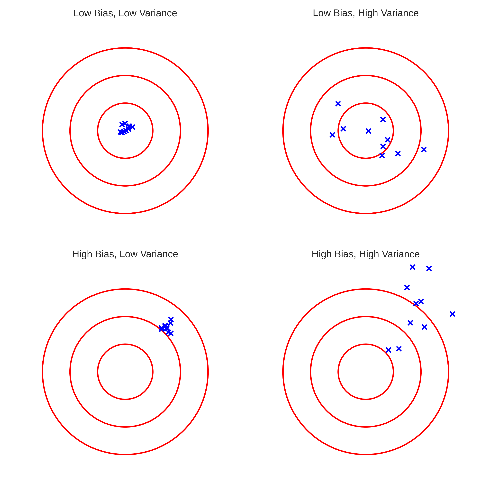

Ước lượng điểm là cầu nối giữa lý thuyết xác suất và thống kê ứng dụng. Từ một mẫu dữ liệu, làm sao chúng ta ước lượng các tham số của tổng thể? Bài học này giới thiệu các phương pháp ước lượng quan trọng nhất - Maximum Likelihood Estimation (MLE) và Method of Moments - cùng với các tính chất mong muốn của một estimator tốt.

---

## Estimator và Estimate

**Estimator** $$\hat{\theta}$$ là một hàm của dữ liệu mẫu:
$$\hat{\theta} = g(X_1, X_2, \ldots, X_n)$$

**Estimate** là giá trị cụ thể của estimator trên một mẫu cụ thể.

**Ví dụ:**
- Estimator: $$\bar{X} = \frac{1}{n}\sum_{i=1}^n X_i$$ (sample mean)
- Estimate: Nếu data = [2, 4, 6], thì estimate = 4

```python
import numpy as np
import matplotlib.pyplot as plt
from scipy import stats
from scipy.optimize import minimize

def illustrate_estimator_vs_estimate():
    """
    Minh họa sự khác biệt giữa estimator và estimate
    """
    # True parameter
    true_mean = 10
    true_std = 2
    
    # Lấy nhiều mẫu khác nhau
    n_samples = 30
    n_experiments = 1000
    
    estimates = []
    for _ in range(n_experiments):
        sample = np.random.normal(true_mean, true_std, n_samples)
        estimate = sample.mean()  # Một estimate cụ thể
        estimates.append(estimate)
    
    estimates = np.array(estimates)
    
    # Visualize
    plt.figure(figsize=(12, 5))
    
    plt.subplot(1, 2, 1)
    plt.hist(estimates, bins=50, density=True, alpha=0.7, edgecolor='black')
    plt.axvline(true_mean, color='red', linestyle='--', linewidth=2, label=f'True μ = {true_mean}')
    plt.axvline(estimates.mean(), color='blue', linestyle='-', linewidth=2, 
                label=f'Mean of estimates = {estimates.mean():.2f}')
    plt.xlabel('Estimate value')
    plt.ylabel('Density')
    plt.title(f'Sampling Distribution of Estimator $\\bar{{X}}$\n({n_experiments} experiments, n={n_samples})')
    plt.legend()
    plt.grid(True, alpha=0.3)
    
    # Một mẫu cụ thể
    one_sample = np.random.normal(true_mean, true_std, n_samples)
    one_estimate = one_sample.mean()
    
    plt.subplot(1, 2, 2)
    plt.hist(one_sample, bins=15, alpha=0.7, edgecolor='black')
    plt.axvline(one_estimate, color='blue', linestyle='-', linewidth=2,
                label=f'Estimate = {one_estimate:.2f}')
    plt.axvline(true_mean, color='red', linestyle='--', linewidth=2,
                label=f'True μ = {true_mean}')
    plt.xlabel('Value')
    plt.ylabel('Frequency')
    plt.title('Một Mẫu Cụ Thể')
    plt.legend()
    plt.grid(True, alpha=0.3)
    
    plt.tight_layout()
    # plt.show()
    
    print("Estimator vs Estimate:")
    print("=" * 60)
    print(f"Estimator: $\\bar{{X}}$ = (1/n) Σ X_i")
    print(f"Một estimate cụ thể: {one_estimate:.4f}")
    print(f"Mean của {n_experiments} estimates: {estimates.mean():.4f}")
    print(f"True parameter: {true_mean}")

# illustrate_estimator_vs_estimate()
```

## Tính Chất của Estimator

### 1. Unbiased (Không Chệch)

Estimator $$\hat{\theta}$$ là unbiased nếu:
$$E[\hat{\theta}] = \theta$$

**Ví dụ:**
- Sample mean $$\bar{X}$$ là unbiased estimator của $$\mu$$
- Sample variance $$S^2 = \frac{1}{n-1}\sum(X_i - \bar{X})^2$$ là unbiased estimator của $$\sigma^2$$
- Nhưng $$\frac{1}{n}\sum(X_i - \bar{X})^2$$ là BIASED!

```python
def demonstrate_bias():
    """
    Minh họa biased vs unbiased estimators
    """
    true_mean = 5
    true_var = 4
    n_samples = 10
    n_experiments = 10000
    
    # Hai estimators cho variance
    biased_estimates = []
    unbiased_estimates = []
    
    for _ in range(n_experiments):
        sample = np.random.normal(true_mean, np.sqrt(true_var), n_samples)
        sample_mean = sample.mean()
        
        # Biased: chia cho n
        biased_var = np.sum((sample - sample_mean)**2) / n_samples
        biased_estimates.append(biased_var)
        
        # Unbiased: chia cho n-1
        unbiased_var = np.sum((sample - sample_mean)**2) / (n_samples - 1)
        unbiased_estimates.append(unbiased_var)
    
    biased_estimates = np.array(biased_estimates)
    unbiased_estimates = np.array(unbiased_estimates)
    
    # Visualize
    plt.figure(figsize=(12, 5))
    
    plt.subplot(1, 2, 1)
    plt.hist(biased_estimates, bins=50, alpha=0.7, label='Biased (÷n)', edgecolor='black')
    plt.hist(unbiased_estimates, bins=50, alpha=0.7, label='Unbiased (÷(n-1))', edgecolor='black')
    plt.axvline(true_var, color='red', linestyle='--', linewidth=2, label=f'True σ² = {true_var}')
    plt.axvline(biased_estimates.mean(), color='blue', linestyle=':', linewidth=2)
    plt.axvline(unbiased_estimates.mean(), color='orange', linestyle=':', linewidth=2)
    plt.xlabel('Estimate')
    plt.ylabel('Frequency')
    plt.title('Biased vs Unbiased Estimators')
    plt.legend()
    plt.grid(True, alpha=0.3)
    
    plt.subplot(1, 2, 2)
    categories = ['Biased\n(÷n)', 'Unbiased\n(÷(n-1))']
    means = [biased_estimates.mean(), unbiased_estimates.mean()]
    bars = plt.bar(categories, means, alpha=0.7, edgecolor='black')
    plt.axhline(true_var, color='red', linestyle='--', linewidth=2, label=f'True σ² = {true_var}')
    plt.ylabel('Mean of Estimates')
    plt.title('Expected Value of Estimators')
    plt.legend()
    plt.grid(True, alpha=0.3, axis='y')
    
    # Thêm giá trị
    for bar, mean in zip(bars, means):
        height = bar.get_height()
        plt.text(bar.get_x() + bar.get_width()/2., height,
                f'{mean:.3f}',
                ha='center', va='bottom', fontsize=12)
    
    plt.tight_layout()
    # plt.show()
    
    print("Bias của Estimators:")
    print("=" * 60)
    print(f"True variance: {true_var}")
    print(f"Biased estimator (÷n):     E[S²] = {biased_estimates.mean():.4f}, Bias = {biased_estimates.mean() - true_var:.4f}")
    print(f"Unbiased estimator (÷n-1): E[S²] = {unbiased_estimates.mean():.4f}, Bias = {unbiased_estimates.mean() - true_var:.4f}")

# demonstrate_bias()
*   **Unbiasedness (Tính không chệch):** $$E(\hat{\theta}) = \theta$$. Trung bình của ước lượng bằng tham số thực.
*   **Consistency (Tính vững):** Khi $$n \to \infty$$, $$\hat{\theta} \to \theta$$ (theo xác suất).
*   **Efficiency (Tính hiệu quả):** Var($\hat{\theta}$) nhỏ nhất có thể.


*Minh họa Bias và Variance qua ví dụ bắn bia. Mục tiêu của chúng ta là "Low Bias, Low Variance" (Góc trên bên trái).*

### Trade-off: Bias vs Variance
Trong Machine Learning, thường có sự đánh đổi này (MSE = Bias^2 + Variance).

### 2. Consistency (Nhất Quán)

Estimator $$\hat{\theta}_n$$ là consistent nếu:
$$\hat{\theta}_n \xrightarrow{P} \theta \quad \text{as } n \to \infty$$

**Ý nghĩa:** Khi có nhiều dữ liệu hơn, estimate sẽ gần với true parameter hơn.

### 3. Efficiency (Hiệu Quả)

Trong các unbiased estimators, estimator nào có variance nhỏ nhất là efficient nhất.

## Maximum Likelihood Estimation (MLE)

**Ý tưởng:** Chọn tham số sao cho khả năng quan sát được dữ liệu hiện tại là lớn nhất.

**Likelihood function:**
$$L(\theta | x_1, \ldots, x_n) = \prod_{i=1}^n f(x_i | \theta)$$

**Log-likelihood:**
$$\ell(\theta) = \log L(\theta) = \sum_{i=1}^n \log f(x_i | \theta)$$

**MLE:**
$$\hat{\theta}_{MLE} = \arg\max_{\theta} \ell(\theta)$$

```python
def mle_normal_distribution():
    """
    MLE cho phân phối chuẩn
    """
    # Sinh dữ liệu
    true_mu, true_sigma = 5, 2
    n_samples = 100
    data = np.random.normal(true_mu, true_sigma, n_samples)
    
    # MLE bằng công thức
    mu_mle = data.mean()
    sigma_mle = np.sqrt(np.mean((data - mu_mle)**2))
    
    # Verify bằng optimization
    def neg_log_likelihood(params):
        mu, sigma = params
        if sigma <= 0:
            return np.inf
        return -np.sum(stats.norm.logpdf(data, mu, sigma))
    
    result = minimize(neg_log_likelihood, x0=[0, 1], method='Nelder-Mead')
    mu_mle_opt, sigma_mle_opt = result.x
    
    # Visualize likelihood surface
    mu_grid = np.linspace(3, 7, 100)
    sigma_grid = np.linspace(1, 3, 100)
    MU, SIGMA = np.meshgrid(mu_grid, sigma_grid)
    
    log_likelihood = np.zeros_like(MU)
    for i in range(len(mu_grid)):
        for j in range(len(sigma_grid)):
            log_likelihood[j, i] = np.sum(stats.norm.logpdf(data, MU[j, i], SIGMA[j, i]))
    
    # Plot
    fig = plt.figure(figsize=(14, 5))
    
    # Contour plot
    ax1 = fig.add_subplot(121)
    contour = ax1.contour(MU, SIGMA, log_likelihood, levels=20)
    ax1.clabel(contour, inline=True, fontsize=8)
    ax1.plot(mu_mle, sigma_mle, 'r*', markersize=20, label='MLE')
    ax1.plot(true_mu, true_sigma, 'go', markersize=10, label='True params')
    ax1.set_xlabel('μ')
    ax1.set_ylabel('σ')
    ax1.set_title('Log-Likelihood Surface')
    ax1.legend()
    ax1.grid(True, alpha=0.3)
    
    # Histogram với fitted distribution
    ax2 = fig.add_subplot(122)
    ax2.hist(data, bins=30, density=True, alpha=0.7, edgecolor='black', label='Data')
    
    x_plot = np.linspace(data.min(), data.max(), 1000)
    ax2.plot(x_plot, stats.norm.pdf(x_plot, mu_mle, sigma_mle), 'r-', 
             linewidth=2, label=f'MLE: N({mu_mle:.2f}, {sigma_mle:.2f}²)')
    ax2.plot(x_plot, stats.norm.pdf(x_plot, true_mu, true_sigma), 'g--',
             linewidth=2, label=f'True: N({true_mu}, {true_sigma}²)')
    ax2.set_xlabel('x')
    ax2.set_ylabel('Density')
    ax2.set_title('Data và Fitted Distribution')
    ax2.legend()
    ax2.grid(True, alpha=0.3)
    
    plt.tight_layout()
    # plt.show()
    
    print("Maximum Likelihood Estimation:")
    print("=" * 60)
    print(f"True parameters:    μ = {true_mu}, σ = {true_sigma}")
    print(f"MLE (formula):      μ = {mu_mle:.4f}, σ = {sigma_mle:.4f}")
    print(f"MLE (optimization): μ = {mu_mle_opt:.4f}, σ = {sigma_mle_opt:.4f}")

# mle_normal_distribution()
```

### MLE cho Các Phân Phối Khác

```python
def mle_examples():
    """
    MLE cho các phân phối khác nhau
    """
    print("MLE cho Các Phân Phối:")
    print("=" * 60)
    
    # 1. Bernoulli/Binomial
    print("\n1. Bernoulli:")
    true_p = 0.7
    n_trials = 100
    data_bern = np.random.binomial(1, true_p, n_trials)
    p_mle = data_bern.mean()
    print(f"   True p = {true_p}")
    print(f"   MLE: p̂ = {p_mle:.4f} (= sample mean)")
    
    # 2. Poisson
    print("\n2. Poisson:")
    true_lambda = 5
    data_pois = np.random.poisson(true_lambda, 100)
    lambda_mle = data_pois.mean()
    print(f"   True λ = {true_lambda}")
    print(f"   MLE: λ̂ = {lambda_mle:.4f} (= sample mean)")
    
    # 3. Exponential
    print("\n3. Exponential:")
    true_rate = 2
    data_exp = np.random.exponential(1/true_rate, 100)
    rate_mle = 1 / data_exp.mean()
    print(f"   True λ = {true_rate}")
    print(f"   MLE: λ̂ = {rate_mle:.4f} (= 1/sample mean)")
    
    # 4. Uniform
    print("\n4. Uniform(0, θ):")
    true_theta = 10
    data_unif = np.random.uniform(0, true_theta, 100)
    theta_mle = data_unif.max()
    print(f"   True θ = {true_theta}")
    print(f"   MLE: θ̂ = {theta_mle:.4f} (= max(data))")
    print(f"   ⚠️  Lưu ý: MLE này là BIASED!")

# mle_examples()
```

## Method of Moments

**Ý tưởng:** Đặt sample moments bằng population moments và giải hệ phương trình.

**Population k-th moment:** $$\mu_k = E[X^k]$$

**Sample k-th moment:** $$m_k = \frac{1}{n}\sum_{i=1}^n X_i^k$$

**Method of Moments:** Giải $$\mu_k(\theta) = m_k$$

```python
def method_of_moments_example():
    """
    So sánh MLE và Method of Moments
    """
    # Sinh dữ liệu từ Gamma(α=2, β=3)
    true_alpha, true_beta = 2, 3
    n_samples = 1000
    data = np.random.gamma(true_alpha, true_beta, n_samples)
    
    # Method of Moments
    # E[X] = αβ, Var(X) = αβ²
    # m1 = sample mean, m2 = sample variance
    m1 = data.mean()
    m2 = data.var()
    
    # Giải: αβ = m1, αβ² = m2
    # => β = m2/m1, α = m1/β = m1²/m2
    beta_mom = m2 / m1
    alpha_mom = m1 / beta_mom
    
    # MLE (dùng scipy)
    def neg_log_likelihood(params):
        alpha, beta = params
        if alpha <= 0 or beta <= 0:
            return np.inf
        return -np.sum(stats.gamma.logpdf(data, alpha, scale=beta))
    
    result = minimize(neg_log_likelihood, x0=[1, 1], method='Nelder-Mead')
    alpha_mle, beta_mle = result.x
    
    # Visualize
    plt.figure(figsize=(12, 5))
    
    plt.subplot(1, 2, 1)
    plt.hist(data, bins=50, density=True, alpha=0.7, edgecolor='black', label='Data')
    
    x_plot = np.linspace(0, data.max(), 1000)
    plt.plot(x_plot, stats.gamma.pdf(x_plot, true_alpha, scale=true_beta), 'g-',
             linewidth=2, label=f'True: Γ({true_alpha}, {true_beta})')
    plt.plot(x_plot, stats.gamma.pdf(x_plot, alpha_mom, scale=beta_mom), 'b--',
             linewidth=2, label=f'MoM: Γ({alpha_mom:.2f}, {beta_mom:.2f})')
    plt.plot(x_plot, stats.gamma.pdf(x_plot, alpha_mle, scale=beta_mle), 'r:',
             linewidth=2, label=f'MLE: Γ({alpha_mle:.2f}, {beta_mle:.2f})')
    plt.xlabel('x')
    plt.ylabel('Density')
    plt.title('Gamma Distribution: MoM vs MLE')
    plt.legend()
    plt.grid(True, alpha=0.3)
    
    # Comparison table
    ax = plt.subplot(1, 2, 2)
    ax.axis('tight')
    ax.axis('off')
    
    table_data = [
        ['Method', 'α', 'β'],
        ['True', f'{true_alpha:.4f}', f'{true_beta:.4f}'],
        ['MoM', f'{alpha_mom:.4f}', f'{beta_mom:.4f}'],
        ['MLE', f'{alpha_mle:.4f}', f'{beta_mle:.4f}']
    ]
    
    table = ax.table(cellText=table_data, cellLoc='center', loc='center',
                     colWidths=[0.3, 0.3, 0.3])
    table.auto_set_font_size(False)
    table.set_fontsize(12)
    table.scale(1, 2)
    
    # Color header
    for i in range(3):
        table[(0, i)].set_facecolor('#40466e')
        table[(0, i)].set_text_props(weight='bold', color='white')
    
    plt.tight_layout()
    # plt.show()
    
    print("Method of Moments vs MLE:")
    print("=" * 60)
    print(f"True:  α = {true_alpha}, β = {true_beta}")
    print(f"MoM:   α = {alpha_mom:.4f}, β = {beta_mom:.4f}")
    print(f"MLE:   α = {alpha_mle:.4f}, β = {beta_mle:.4f}")

# method_of_moments_example()
```

## Bài Tập Thực Hành

**Bài 1: Verify Unbiasedness**
Cho X ~ Uniform(0, θ). Estimator $$\hat{\theta} = 2\bar{X}$$ có unbiased không?
- Tính E[$$\hat{\theta}$$] bằng lý thuyết
- Verify bằng mô phỏng với θ = 10

**Bài 2: MLE cho Exponential**
Sinh 100 mẫu từ Exponential(λ=2).
- Tính MLE bằng công thức
- Vẽ log-likelihood function
- Verify bằng optimization

**Bài 3: Consistency**
Với X ~ N(μ, σ²), verify rằng sample mean là consistent:
- Lấy mẫu với n = 10, 50, 100, 500, 1000
- Tính variance của estimator cho mỗi n
- Vẽ biểu đồ variance vs n

**Bài 4: MLE cho Mixture Model**
Dữ liệu từ mixture: 0.6 × N(0, 1) + 0.4 × N(5, 1).
- Implement EM algorithm để estimate parameters
- So sánh với true parameters
