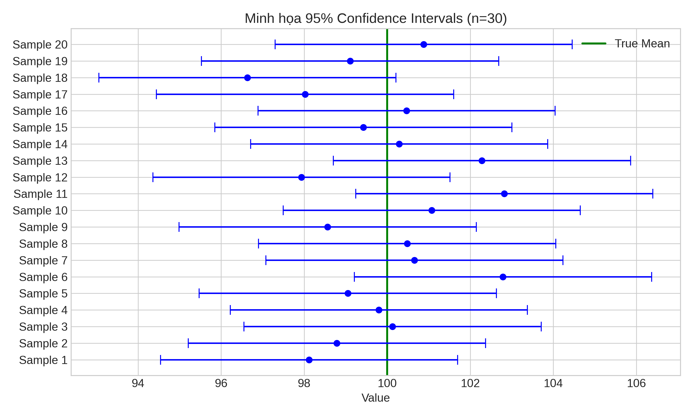

Point estimate cho ta một con số, nhưng không cho biết độ tin cậy. Confidence intervals (CI) giải quyết vấn đề này bằng cách cung cấp một khoảng giá trị có khả năng chứa true parameter. Bài học này sẽ giúp bạn hiểu đúng ý nghĩa của CI (và những hiểu lầm phổ biến), cách tính CI cho mean và proportion, và giới thiệu Bootstrap - công cụ mạnh mẽ để tính CI cho bất kỳ statistic nào.

---

## Confidence Interval Là Gì?

**Định nghĩa:** Confidence interval 95% là một khoảng ngẫu nhiên $$[L, U]$$ sao cho:

$$P(L \leq \theta \leq U) = 0.95$$

**Ý nghĩa thực sự:**
Nếu chúng ta lặp lại việc lấy mẫu 100 lần và tính 100 khoảng tin cậy 95%, thì **khoảng 95 khoảng** sẽ chứa tham số thực $$\mu$$.
*Không phải* là xác suất 95% tham số nằm trong một khoảng cụ thể đã tính (vì tham số là hằng số, khoảng đã tính là cố định).


*Minh họa: 20 mẫu thử được rút ra. Các đoạn thẳng màu xanh chứa giá trị thực (Mean = 100), đoạn màu đỏ không chứa. Với 95% CI, hầu hết các đoạn sẽ màu xanh.*
- SAI vì θ là hằng số, không phải biến ngẫu nhiên!

```python
import numpy as np
import matplotlib.pyplot as plt
from scipy import stats

def visualize_ci_concept():
    """
    Minh họa ý nghĩa của confidence interval
    """
    # True parameter
    true_mean = 10
    true_std = 2
    
    # Lấy nhiều mẫu và tính CI cho mỗi mẫu
    n_samples = 30
    n_experiments = 100
    confidence_level = 0.95
    
    # Z-score cho 95% CI
    z_score = stats.norm.ppf((1 + confidence_level) / 2)
    
    # Lưu các CI
    intervals = []
    contains_true = []
    
    for _ in range(n_experiments):
        sample = np.random.normal(true_mean, true_std, n_samples)
        sample_mean = sample.mean()
        sample_std = sample.std(ddof=1)
        
        # CI: mean ± z * (std / sqrt(n))
        margin = z_score * (sample_std / np.sqrt(n_samples))
        lower = sample_mean - margin
        upper = sample_mean + margin
        
        intervals.append((lower, upper))
        contains_true.append(lower <= true_mean <= upper)
    
    # Visualize
    fig, axes = plt.subplots(1, 2, figsize=(14, 6))
    
    # Plot intervals
    ax1 = axes[0]
    for i, ((lower, upper), contains) in enumerate(zip(intervals[:50], contains_true[:50])):
        color = 'green' if contains else 'red'
        ax1.plot([lower, upper], [i, i], color=color, linewidth=1.5, alpha=0.7)
        ax1.plot([(lower + upper)/2], [i], 'o', color=color, markersize=3)
    
    ax1.axvline(true_mean, color='blue', linestyle='--', linewidth=2, label=f'True μ = {true_mean}')
    ax1.set_xlabel('Value')
    ax1.set_ylabel('Experiment number')
    ax1.set_title(f'50 Confidence Intervals (95% level)\nGreen: chứa true μ, Red: không chứa')
    ax1.legend()
    ax1.grid(True, alpha=0.3, axis='x')
    
    # Coverage
    coverage = np.mean(contains_true)
    ax2 = axes[1]
    ax2.bar(['Chứa true μ', 'Không chứa'], 
            [coverage * 100, (1-coverage) * 100],
            color=['green', 'red'], alpha=0.7, edgecolor='black')
    ax2.axhline(95, color='blue', linestyle='--', linewidth=2, label='Expected 95%')
    ax2.set_ylabel('Percentage (%)')
    ax2.set_title(f'Coverage: {coverage*100:.1f}% ({n_experiments} experiments)')
    ax2.legend()
    ax2.grid(True, alpha=0.3, axis='y')
    
    plt.tight_layout()
    # plt.show()
    
    print("Confidence Interval Concept:")
    print("=" * 60)
    print(f"True mean: {true_mean}")
    print(f"Confidence level: {confidence_level*100}%")
    print(f"Number of experiments: {n_experiments}")
    print(f"Coverage (% intervals containing true mean): {coverage*100:.1f}%")
    print()
    print("⚠️  Ý nghĩa ĐÚNG: 95% các intervals (từ các mẫu khác nhau) chứa true parameter")
    print("⚠️  KHÔNG phải: Xác suất để true parameter nằm trong một interval cụ thể là 95%")

# visualize_ci_concept()
```

## CI cho Mean (Biết Variance)

Nếu $$X_1, \ldots, X_n \sim N(\mu, \sigma^2)$$ và biết $$\sigma$$:

$$\bar{X} \pm z_{\alpha/2} \cdot \frac{\sigma}{\sqrt{n}}$$

Với $$z_{\alpha/2}$$ là quantile của N(0,1):
- 90% CI: $$z_{0.05} = 1.645$$
- 95% CI: $$z_{0.025} = 1.96$$
- 99% CI: $$z_{0.005} = 2.576$$

```python
def ci_known_variance():
    """
    CI cho mean khi biết variance
    """
    # Sinh dữ liệu
    true_mean, true_std = 100, 15
    n_samples = 50
    data = np.random.normal(true_mean, true_std, n_samples)
    
    # Tính CI với các confidence levels khác nhau
    sample_mean = data.mean()
    confidence_levels = [0.90, 0.95, 0.99]
    
    print("CI cho Mean (Biết σ):")
    print("=" * 60)
    print(f"True mean: {true_mean}, True std: {true_std}")
    print(f"Sample mean: {sample_mean:.2f}, n = {n_samples}")
    print()
    
    fig, ax = plt.subplots(figsize=(12, 6))
    
    for i, conf_level in enumerate(confidence_levels):
        z_score = stats.norm.ppf((1 + conf_level) / 2)
        margin = z_score * (true_std / np.sqrt(n_samples))
        lower = sample_mean - margin
        upper = sample_mean + margin
        
        print(f"{conf_level*100}% CI: [{lower:.2f}, {upper:.2f}]")
        print(f"  Width: {upper - lower:.2f}")
        print(f"  Margin of error: ±{margin:.2f}")
        print()
        
        # Vẽ
        y_pos = i
        ax.plot([lower, upper], [y_pos, y_pos], linewidth=3, label=f'{conf_level*100}% CI')
        ax.plot([sample_mean], [y_pos], 'o', markersize=10, color='black')
    
    ax.axvline(true_mean, color='red', linestyle='--', linewidth=2, label=f'True μ = {true_mean}')
    ax.set_yticks(range(len(confidence_levels)))
    ax.set_yticklabels([f'{cl*100}%' for cl in confidence_levels])
    ax.set_xlabel('Value')
    ax.set_title('Confidence Intervals với Các Mức Tin Cậy Khác Nhau')
    ax.legend()
    ax.grid(True, alpha=0.3, axis='x')
    
    plt.tight_layout()
    # plt.show()

# ci_known_variance()
```

## CI cho Mean (Không Biết Variance) - t-Distribution

Khi không biết $$\sigma$$, dùng sample standard deviation $$s$$ và t-distribution:

$$\bar{X} \pm t_{\alpha/2, n-1} \cdot \frac{s}{\sqrt{n}}$$

```python
def ci_unknown_variance():
    """
    CI cho mean khi KHÔNG biết variance (dùng t-distribution)
    """
    # Sinh dữ liệu
    true_mean, true_std = 100, 15
    n_samples = 20  # Mẫu nhỏ
    data = np.random.normal(true_mean, true_std, n_samples)
    
    sample_mean = data.mean()
    sample_std = data.std(ddof=1)
    
    # So sánh Z-based vs t-based CI
    confidence_level = 0.95
    
    # Z-based (SAI khi không biết σ!)
    z_score = stats.norm.ppf((1 + confidence_level) / 2)
    margin_z = z_score * (sample_std / np.sqrt(n_samples))
    ci_z = (sample_mean - margin_z, sample_mean + margin_z)
    
    # t-based (ĐÚNG)
    t_score = stats.t.ppf((1 + confidence_level) / 2, df=n_samples-1)
    margin_t = t_score * (sample_std / np.sqrt(n_samples))
    ci_t = (sample_mean - margin_t, sample_mean + margin_t)
    
    # Visualize
    fig, axes = plt.subplots(1, 2, figsize=(14, 5))
    
    # So sánh t vs Z distribution
    x = np.linspace(-4, 4, 1000)
    axes[0].plot(x, stats.norm.pdf(x), linewidth=2, label='Z ~ N(0,1)')
    axes[0].plot(x, stats.t.pdf(x, df=n_samples-1), linewidth=2, label=f't (df={n_samples-1})')
    axes[0].axvline(z_score, color='blue', linestyle='--', label=f'z = {z_score:.3f}')
    axes[0].axvline(t_score, color='red', linestyle='--', label=f't = {t_score:.3f}')
    axes[0].set_xlabel('x')
    axes[0].set_ylabel('Density')
    axes[0].set_title('t-distribution có đuôi dày hơn Z')
    axes[0].legend()
    axes[0].grid(True, alpha=0.3)
    
    # So sánh CI
    axes[1].plot(ci_z, [0, 0], linewidth=3, label=f'Z-based: [{ci_z[0]:.2f}, {ci_z[1]:.2f}]')
    axes[1].plot(ci_t, [1, 1], linewidth=3, label=f't-based: [{ci_t[0]:.2f}, {ci_t[1]:.2f}]')
    axes[1].plot([sample_mean, sample_mean], [0, 1], 'ko', markersize=10)
    axes[1].axvline(true_mean, color='green', linestyle='--', linewidth=2, label=f'True μ = {true_mean}')
    axes[1].set_yticks([0, 1])
    axes[1].set_yticklabels(['Z-based\n(SAI!)', 't-based\n(ĐÚNG)'])
    axes[1].set_xlabel('Value')
    axes[1].set_title(f'95% CI (n={n_samples})')
    axes[1].legend()
    axes[1].grid(True, alpha=0.3, axis='x')
    
    plt.tight_layout()
    # plt.show()
    
    print("CI cho Mean (Không biết σ):")
    print("=" * 60)
    print(f"Sample size: n = {n_samples}")
    print(f"Sample mean: {sample_mean:.2f}")
    print(f"Sample std: {sample_std:.2f}")
    print()
    print(f"Z-based CI (SAI!): [{ci_z[0]:.2f}, {ci_z[1]:.2f}], width = {ci_z[1]-ci_z[0]:.2f}")
    print(f"t-based CI (ĐÚNG): [{ci_t[0]:.2f}, {ci_t[1]:.2f}], width = {ci_t[1]-ci_t[0]:.2f}")
    print()
    print(f"⚠️  t-based CI rộng hơn vì account for uncertainty trong estimate của σ")

# ci_unknown_variance()
```

## CI cho Proportion

Cho $$X \sim \text{Binomial}(n, p)$$, estimate $$\hat{p} = X/n$$:

**Wald CI (approximation):**
$$\hat{p} \pm z_{\alpha/2} \sqrt{\frac{\hat{p}(1-\hat{p})}{n}}$$

**Wilson CI (better):** Phức tạp hơn nhưng coverage tốt hơn với n nhỏ

```python
def ci_proportion():
    """
    CI cho proportion
    """
    # Dữ liệu: 45 successes trong 100 trials
    n_trials = 100
    n_success = 45
    p_hat = n_success / n_trials
    
    confidence_level = 0.95
    z_score = stats.norm.ppf((1 + confidence_level) / 2)
    
    # Wald CI
    se = np.sqrt(p_hat * (1 - p_hat) / n_trials)
    margin = z_score * se
    ci_wald = (p_hat - margin, p_hat + margin)
    
    # Wilson CI (better for small n or extreme p)
    # Formula: (p̂ + z²/(2n) ± z√(p̂(1-p̂)/n + z²/(4n²))) / (1 + z²/n)
    z2 = z_score**2
    denominator = 1 + z2/n_trials
    center = (p_hat + z2/(2*n_trials)) / denominator
    margin_wilson = z_score * np.sqrt((p_hat*(1-p_hat)/n_trials + z2/(4*n_trials**2))) / denominator
    ci_wilson = (center - margin_wilson, center + margin_wilson)
    
    print("CI cho Proportion:")
    print("=" * 60)
    print(f"Data: {n_success} successes in {n_trials} trials")
    print(f"p̂ = {p_hat:.3f}")
    print()
    print(f"Wald CI:   [{ci_wald[0]:.3f}, {ci_wald[1]:.3f}]")
    print(f"Wilson CI: [{ci_wilson[0]:.3f}, {ci_wilson[1]:.3f}]")
    print()
    print("⚠️  Wilson CI thường tốt hơn, đặc biệt khi n nhỏ hoặc p gần 0/1")
    
    # Verify coverage bằng simulation
    true_p = 0.45
    n_sims = 10000
    wald_coverage = 0
    wilson_coverage = 0
    
    for _ in range(n_sims):
        sample = np.random.binomial(n_trials, true_p)
        p_hat_sim = sample / n_trials
        
        # Wald
        se_sim = np.sqrt(p_hat_sim * (1 - p_hat_sim) / n_trials)
        margin_sim = z_score * se_sim
        ci_wald_sim = (p_hat_sim - margin_sim, p_hat_sim + margin_sim)
        if ci_wald_sim[0] <= true_p <= ci_wald_sim[1]:
            wald_coverage += 1
        
        # Wilson
        center_sim = (p_hat_sim + z2/(2*n_trials)) / denominator
        margin_wilson_sim = z_score * np.sqrt((p_hat_sim*(1-p_hat_sim)/n_trials + z2/(4*n_trials**2))) / denominator
        ci_wilson_sim = (center_sim - margin_wilson_sim, center_sim + margin_wilson_sim)
        if ci_wilson_sim[0] <= true_p <= ci_wilson_sim[1]:
            wilson_coverage += 1
    
    print(f"\nCoverage Simulation (true p = {true_p}):")
    print(f"Wald CI:   {wald_coverage/n_sims*100:.2f}%")
    print(f"Wilson CI: {wilson_coverage/n_sims*100:.2f}%")
    print(f"Expected:  {confidence_level*100}%")

# ci_proportion()
```

## Bootstrap Confidence Intervals

Bootstrap là phương pháp mạnh mẽ để tính CI cho BẤT KỲ statistic nào, không cần giả định về phân phối!

**Ý tưởng:** Resample từ dữ liệu với replacement, tính statistic cho mỗi resample.

```python
def bootstrap_ci():
    """
    Bootstrap confidence intervals
    """
    # Dữ liệu (không chuẩn!)
    np.random.seed(42)
    data = np.concatenate([
        np.random.exponential(2, 50),
        np.random.normal(10, 1, 30)
    ])
    
    # Statistic: median
    observed_median = np.median(data)
    
    # Bootstrap
    n_bootstrap = 10000
    bootstrap_medians = []
    
    for _ in range(n_bootstrap):
        # Resample with replacement
        resample = np.random.choice(data, size=len(data), replace=True)
        bootstrap_medians.append(np.median(resample))
    
    bootstrap_medians = np.array(bootstrap_medians)
    
    # CI methods
    confidence_level = 0.95
    alpha = 1 - confidence_level
    
    # 1. Percentile method
    ci_percentile = np.percentile(bootstrap_medians, [alpha/2*100, (1-alpha/2)*100])
    
    # 2. Normal approximation
    se_bootstrap = bootstrap_medians.std()
    z_score = stats.norm.ppf((1 + confidence_level) / 2)
    ci_normal = (observed_median - z_score*se_bootstrap, observed_median + z_score*se_bootstrap)
    
    # Visualize
    fig, axes = plt.subplots(1, 2, figsize=(14, 5))
    
    # Original data
    axes[0].hist(data, bins=30, alpha=0.7, edgecolor='black')
    axes[0].axvline(observed_median, color='red', linestyle='--', linewidth=2, 
                   label=f'Median = {observed_median:.2f}')
    axes[0].set_xlabel('Value')
    axes[0].set_ylabel('Frequency')
    axes[0].set_title('Original Data (Non-normal!)')
    axes[0].legend()
    axes[0].grid(True, alpha=0.3)
    
    # Bootstrap distribution
    axes[1].hist(bootstrap_medians, bins=50, alpha=0.7, edgecolor='black', density=True)
    axes[1].axvline(observed_median, color='red', linestyle='--', linewidth=2, label='Observed median')
    axes[1].axvline(ci_percentile[0], color='blue', linestyle=':', linewidth=2)
    axes[1].axvline(ci_percentile[1], color='blue', linestyle=':', linewidth=2, 
                   label=f'95% CI: [{ci_percentile[0]:.2f}, {ci_percentile[1]:.2f}]')
    axes[1].set_xlabel('Bootstrap Median')
    axes[1].set_ylabel('Density')
    axes[1].set_title(f'Bootstrap Distribution ({n_bootstrap:,} resamples)')
    axes[1].legend()
    axes[1].grid(True, alpha=0.3)
    
    plt.tight_layout()
    # plt.show()
    
    print("Bootstrap Confidence Intervals:")
    print("=" * 60)
    print(f"Observed median: {observed_median:.2f}")
    print(f"Bootstrap SE: {se_bootstrap:.2f}")
    print()
    print(f"Percentile CI:  [{ci_percentile[0]:.2f}, {ci_percentile[1]:.2f}]")
    print(f"Normal approx:  [{ci_normal[0]:.2f}, {ci_normal[1]:.2f}]")
    print()
    print("✓ Bootstrap hoạt động cho BẤT KỲ statistic nào!")
    print("✓ Không cần giả định về phân phối!")

# bootstrap_ci()
```

## Bài Tập Thực Hành

**Bài 1: Coverage Simulation**
Sinh 1000 mẫu từ N(50, 10²), n=25. Cho mỗi mẫu:
- Tính 95% CI bằng t-distribution
- Kiểm tra xem CI có chứa true mean không
- Tính coverage rate, so sánh với 95%

**Bài 2: CI Width vs Sample Size**
Với fixed confidence level (95%):
- Tính CI width cho n = 10, 20, 50, 100, 200
- Vẽ biểu đồ width vs n
- Verify rằng width ∝ 1/√n

**Bài 3: Bootstrap cho Correlation**
Sinh dữ liệu (X, Y) với correlation ρ = 0.6.
- Tính bootstrap CI cho correlation coefficient
- So sánh với Fisher's z-transformation CI
- Thử với n = 20, 50, 100

**Bài 4: Misinterpretation**
Tạo visualization minh họa sự khác biệt giữa:
- "95% CI chứa true parameter" (ĐÚNG)
- "True parameter có 95% xác suất trong CI" (SAI)
