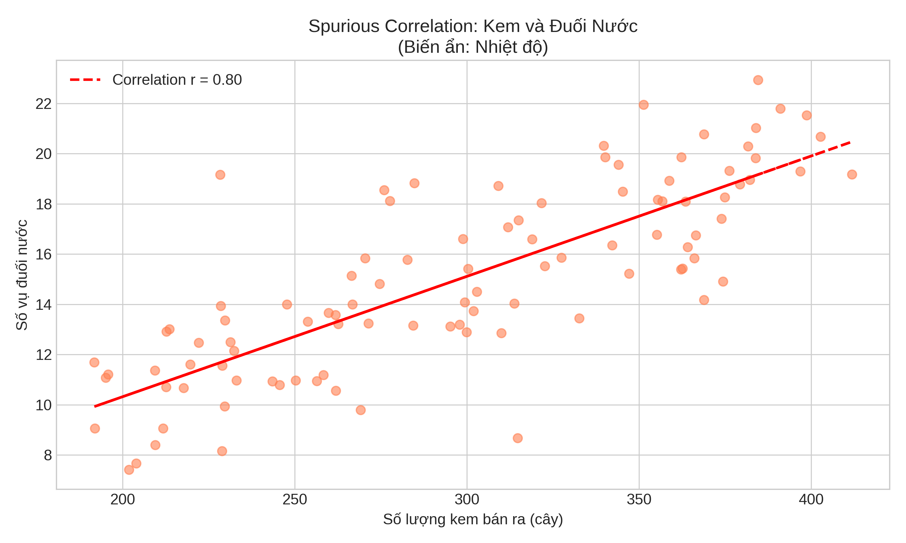

Hồi quy tuyến tính đơn giản là cầu nối giữa thống kê cổ điển và machine learning. Trong bài học này, chúng ta sẽ tiếp cận linear regression từ góc độ thống kê - không chỉ fit một đường thẳng, mà hiểu được uncertainty trong estimates, kiểm định giả thuyết về coefficients, và đánh giá model fit. Đây là nền tảng để hiểu các mô hình phức tạp hơn trong ML.

---

## Correlation Coefficient

Trước khi đến regression, hãy hiểu về correlation - đo lường mối quan hệ tuyến tính giữa hai biến.

**Pearson Correlation Coefficient:**

$$r = \frac{\sum_{i=1}^n (x_i - \bar{x})(y_i - \bar{y})}{\sqrt{\sum_{i=1}^n (x_i - \bar{x})^2} \sqrt{\sum_{i=1}^n (y_i - \bar{y})^2}}$$

**Tính chất:**
- $$-1 \leq r \leq 1$$
- $$r = 1$$: Perfect positive linear relationship
- $$r = -1$$: Perfect negative linear relationship
- $$r = 0$$: No linear relationship (nhưng có thể có quan hệ phi tuyến!)

```python
import numpy as np
import matplotlib.pyplot as plt
from scipy import stats
import seaborn as sns

def visualize_correlation_examples():
    """
    Minh họa correlation với các patterns khác nhau
    """
    np.random.seed(42)
    n = 100
    
    # Tạo các datasets với correlation khác nhau
    datasets = []
    
    # 1. Strong positive
    x1 = np.random.normal(0, 1, n)
    y1 = 2*x1 + np.random.normal(0, 0.5, n)
    datasets.append(('Strong Positive\nr ≈ 0.97', x1, y1))
    
    # 2. Moderate positive
    x2 = np.random.normal(0, 1, n)
    y2 = x2 + np.random.normal(0, 1.5, n)
    datasets.append(('Moderate Positive\nr ≈ 0.55', x2, y2))
    
    # 3. No correlation
    x3 = np.random.normal(0, 1, n)
    y3 = np.random.normal(0, 1, n)
    datasets.append(('No Correlation\nr ≈ 0', x3, y3))
    
    # 4. Negative
    x4 = np.random.normal(0, 1, n)
    y4 = -1.5*x4 + np.random.normal(0, 0.8, n)
    datasets.append(('Negative\nr ≈ -0.88', x4, y4))
    
    # 5. Non-linear (r ≈ 0 nhưng có quan hệ!)
    x5 = np.linspace(-3, 3, n)
    y5 = x5**2 + np.random.normal(0, 1, n)
    datasets.append(('Non-linear\nr ≈ 0 (!)', x5, y5))
    
    # 6. Outlier effect
    x6 = np.random.normal(0, 1, n-1)
    y6 = 0.3*x6 + np.random.normal(0, 1, n-1)
    x6 = np.append(x6, 5)
    y6 = np.append(y6, 5)
    datasets.append(('With Outlier\nr changes!', x6, y6))
    
    # Plot
    fig, axes = plt.subplots(2, 3, figsize=(15, 10))
    axes = axes.flatten()
    
    for i, (title, x, y) in enumerate(datasets):
        r = np.corrcoef(x, y)[0, 1]
        
        axes[i].scatter(x, y, alpha=0.6, s=30)
        
        # Fit line
        z = np.polyfit(x, y, 1)
        p = np.poly1d(z)
        x_line = np.linspace(x.min(), x.max(), 100)
        axes[i].plot(x_line, p(x_line), 'r--', linewidth=2, alpha=0.8)
        
        axes[i].set_xlabel('X')
        axes[i].set_ylabel('Y')
        axes[i].set_title(f'{title}\nActual r = {r:.3f}')
        axes[i].grid(True, alpha=0.3)
    
    plt.tight_layout()
    # plt.show()

# visualize_correlation_examples()
```

## Cạm Bẫy: Spurious Correlations (Mối Quan Hệ Giả)

> *"Correlation does not imply causation."* - Câu thần chú của mọi nhà thống kê.

Trong cuốn **Naked Statistics**, Charles Wheelan đưa ra một ví dụ thú vị: Có một mối tương quan chặt chẽ giữa số lượng bằng tiến sĩ về Xã hội học và số vụ chết đuối trong hồ bơi tại Mỹ.
- Liệu học Xã hội học khiến người ta dễ chết đuối?
- Hay việc chết đuối khiến người ta muốn học Xã hội học?

Không cái nào cả! Cả hai đều tăng lên theo thời gian (biến ẩn là **Thời gian/Sự phát triển dân số/Kinh tế**). Đây là **Spurious Correlation** (Tương quan giả).

### Biến Gây Nhiễu (Confounding Variable)
Một ví dụ kinh điển khác:
- **Dữ liệu:** Số lượng kem bán ra tăng $$\rightarrow$$ Số vụ chết đuối tăng (Correlation > 0).
- **Kết luận SAI:** Ăn kem gây chết đuối.
- **Sự thật:** **Nhiệt độ (Z)** là biến gây nhiễu. Trời nóng $$\rightarrow$$ Ăn kem nhiều VÀ Đi bơi nhiều $$\rightarrow$$ Chết đuối nhiều.


*Dữ liệu thực tế cho thấy correlation mạnh (đường đỏ), nhưng không có quan hệ nhân quả!*


*Sơ đồ minh họa biến ẩn (Nhiệt độ) gây ra sự tăng đồng thời của cả hai yếu tố.*

```python
def spurious_correlation_demo():
    """
    Minh họa Spurious Correlation: Kem vs Chết đuối
    """
    np.random.seed(42)
    n = 100
    
    # Biến gây nhiễu (Confounding variable): Nhiệt độ
    temperature = np.linspace(20, 40, n) + np.random.normal(0, 2, n)
    
    # Số lượng kem bán ra (phụ thuộc vào nhiệt độ)
    ice_cream_sales = 10 * temperature + np.random.normal(0, 10, n)
    
    # Số vụ chết đuối (cũng phụ thuộc vào nhiệt độ)
    drowning_incidents = 0.5 * temperature + np.random.normal(0, 2, n)
    
    # Tính correlation giữa Kem và Chết đuối
    correlation = np.corrcoef(ice_cream_sales, drowning_incidents)[0, 1]
    
    # Visualization
    fig, ax1 = plt.subplots(figsize=(10, 6))
    
    color = 'tab:blue'
    ax1.set_xlabel('Số lượng kem bán ra (cây)')
    ax1.set_ylabel('Số vụ đuối nước', color=color)
    ax1.scatter(ice_cream_sales, drowning_incidents, color=color, alpha=0.6)
    ax1.tick_params(axis='y', labelcolor=color)
    
    # Fit line
    z = np.polyfit(ice_cream_sales, drowning_incidents, 1)
    p = np.poly1d(z)
    ax1.plot(ice_cream_sales, p(ice_cream_sales), "r--", linewidth=2, label=f'Correlation r = {correlation:.2f}')
    
    plt.title('Spurious Correlation: Kem và Đuối Nước\n(Biến ẩn: Nhiệt độ)')
    plt.legend(loc='upper left')
    plt.grid(True, alpha=0.3)
    # plt.show()
    
    print("Spurious Correlation Demo:")
    print("=" * 60)
    print(f"Correlation(Kem, Đuối nước) = {correlation:.2f}")
    print("Kết luận SAI: Ăn kem nhiều gây đuối nước.")
    print("Sự thật: Nhiệt độ cao làm tăng cả hai!")

# spurious_correlation_demo()
```

### Spearman Correlation

Đo lường mối quan hệ **monotonic** (không nhất thiết tuyến tính):

```python
def pearson_vs_spearman():
    """
    So sánh Pearson và Spearman correlation
    """
    # Non-linear monotonic relationship
    x = np.linspace(0, 10, 100)
    y = np.exp(0.3*x) + np.random.normal(0, 5, 100)
    
    # Correlations
    pearson_r = np.corrcoef(x, y)[0, 1]
    spearman_r, _ = stats.spearmanr(x, y)
    
    # Plot
    fig, axes = plt.subplots(1, 2, figsize=(14, 5))
    
    # Scatter plot
    axes[0].scatter(x, y, alpha=0.6)
    axes[0].set_xlabel('X')
    axes[0].set_ylabel('Y')
    axes[0].set_title(f'Non-linear Relationship\nPearson r = {pearson_r:.3f}\nSpearman ρ = {spearman_r:.3f}')
    axes[0].grid(True, alpha=0.3)
    
    # Rank plot
    rank_x = stats.rankdata(x)
    rank_y = stats.rankdata(y)
    axes[1].scatter(rank_x, rank_y, alpha=0.6)
    axes[1].set_xlabel('Rank of X')
    axes[1].set_ylabel('Rank of Y')
    axes[1].set_title('Ranks (Spearman uses this)')
    axes[1].grid(True, alpha=0.3)
    
    plt.tight_layout()
    # plt.show()
    
    print("Pearson vs Spearman:")
    print("=" * 60)
    print(f"Pearson r:  {pearson_r:.3f} (measures linear relationship)")
    print(f"Spearman ρ: {spearman_r:.3f} (measures monotonic relationship)")
    print()
    print("✓ Spearman tốt hơn cho non-linear monotonic relationships")

# pearson_vs_spearman()
```

## Simple Linear Regression

**Model:**
$$Y_i = \beta_0 + \beta_1 X_i + \epsilon_i$$

Với:
- $$\beta_0$$: Intercept
- $$\beta_1$$: Slope
- $$\epsilon_i \sim N(0, \sigma^2)$$: Error term

**Least Squares Estimates:**

$$\hat{\beta}_1 = \frac{\sum_{i=1}^n (x_i - \bar{x})(y_i - \bar{y})}{\sum_{i=1}^n (x_i - \bar{x})^2}$$

$$\hat{\beta}_0 = \bar{y} - \hat{\beta}_1 \bar{x}$$

```python
def simple_linear_regression():
    """
    Simple linear regression từ scratch
    """
    # Sinh dữ liệu
    np.random.seed(42)
    n = 50
    true_beta0, true_beta1 = 5, 2
    true_sigma = 3
    
    x = np.random.uniform(0, 10, n)
    y = true_beta0 + true_beta1 * x + np.random.normal(0, true_sigma, n)
    
    # Least squares estimates
    x_mean = x.mean()
    y_mean = y.mean()
    
    beta1_hat = np.sum((x - x_mean) * (y - y_mean)) / np.sum((x - x_mean)**2)
    beta0_hat = y_mean - beta1_hat * x_mean
    
    # Predictions
    y_pred = beta0_hat + beta1_hat * x
    
    # Residuals
    residuals = y - y_pred
    
    # Residual standard error
    rse = np.sqrt(np.sum(residuals**2) / (n - 2))
    
    # Visualize
    fig, axes = plt.subplots(1, 3, figsize=(16, 5))
    
    # 1. Regression line
    axes[0].scatter(x, y, alpha=0.6, s=50, label='Data')
    x_line = np.linspace(x.min(), x.max(), 100)
    y_line = beta0_hat + beta1_hat * x_line
    axes[0].plot(x_line, y_line, 'r-', linewidth=2, 
                label=f'ŷ = {beta0_hat:.2f} + {beta1_hat:.2f}x')
    
    # True line
    y_true = true_beta0 + true_beta1 * x_line
    axes[0].plot(x_line, y_true, 'g--', linewidth=2, alpha=0.7,
                label=f'True: y = {true_beta0} + {true_beta1}x')
    
    axes[0].set_xlabel('X')
    axes[0].set_ylabel('Y')
    axes[0].set_title('Simple Linear Regression')
    axes[0].legend()
    axes[0].grid(True, alpha=0.3)
    
    # 2. Residuals vs Fitted
    axes[1].scatter(y_pred, residuals, alpha=0.6, s=50)
    axes[1].axhline(0, color='red', linestyle='--', linewidth=2)
    axes[1].set_xlabel('Fitted values')
    axes[1].set_ylabel('Residuals')
    axes[1].set_title('Residuals vs Fitted')
    axes[1].grid(True, alpha=0.3)
    
    # 3. Q-Q plot
    stats.probplot(residuals, dist="norm", plot=axes[2])
    axes[2].set_title('Normal Q-Q Plot')
    axes[2].grid(True, alpha=0.3)
    
    plt.tight_layout()
    # plt.show()
    
    print("Simple Linear Regression:")
    print("=" * 60)
    print(f"True model: Y = {true_beta0} + {true_beta1}X + ε, σ = {true_sigma}")
    print()
    print(f"Estimates:")
    print(f"  β₀̂ = {beta0_hat:.4f} (true: {true_beta0})")
    print(f"  β₁̂ = {beta1_hat:.4f} (true: {true_beta1})")
    print(f"  RSE = {rse:.4f} (true σ: {true_sigma})")
    
    return x, y, beta0_hat, beta1_hat

# x, y, beta0_hat, beta1_hat = simple_linear_regression()
```

## Statistical Inference for Regression

### Standard Errors và Confidence Intervals

**Standard Error của $$\hat{\beta}_1$$:**

$$SE(\hat{\beta}_1) = \frac{\sigma}{\sqrt{\sum_{i=1}^n (x_i - \bar{x})^2}}$$

**95% CI cho $$\beta_1$$:**

$$\hat{\beta}_1 \pm t_{0.025, n-2} \cdot SE(\hat{\beta}_1)$$

```python
def regression_inference(x, y, beta0_hat, beta1_hat):
    """
    Statistical inference cho regression coefficients
    """
    n = len(x)
    
    # Predictions và residuals
    y_pred = beta0_hat + beta1_hat * x
    residuals = y - y_pred
    
    # Residual standard error
    rse = np.sqrt(np.sum(residuals**2) / (n - 2))
    
    # Standard errors
    x_mean = x.mean()
    se_beta1 = rse / np.sqrt(np.sum((x - x_mean)**2))
    se_beta0 = rse * np.sqrt(1/n + x_mean**2 / np.sum((x - x_mean)**2))
    
    # t-statistics
    t_beta0 = beta0_hat / se_beta0
    t_beta1 = beta1_hat / se_beta1
    
    # p-values (two-tailed)
    p_beta0 = 2 * (1 - stats.t.cdf(abs(t_beta0), df=n-2))
    p_beta1 = 2 * (1 - stats.t.cdf(abs(t_beta1), df=n-2))
    
    # 95% CI
    t_critical = stats.t.ppf(0.975, df=n-2)
    ci_beta0 = (beta0_hat - t_critical*se_beta0, beta0_hat + t_critical*se_beta0)
    ci_beta1 = (beta1_hat - t_critical*se_beta1, beta1_hat + t_critical*se_beta1)
    
    # Verify với sklearn
    from sklearn.linear_model import LinearRegression
    model = LinearRegression()
    model.fit(x.reshape(-1, 1), y)
    
    print("Statistical Inference for Regression:")
    print("=" * 60)
    print(f"{'Coefficient':<15} {'Estimate':<12} {'Std Error':<12} {'t value':<10} {'Pr(>|t|)':<12}")
    print("-" * 60)
    print(f"{'Intercept':<15} {beta0_hat:>11.4f} {se_beta0:>11.4f} {t_beta0:>9.3f} {p_beta0:>11.6f}")
    print(f"{'Slope':<15} {beta1_hat:>11.4f} {se_beta1:>11.4f} {t_beta1:>9.3f} {p_beta1:>11.6f}")
    print()
    print(f"Residual standard error: {rse:.4f} on {n-2} degrees of freedom")
    print()
    print("95% Confidence Intervals:")
    print(f"  β₀: [{ci_beta0[0]:.4f}, {ci_beta0[1]:.4f}]")
    print(f"  β₁: [{ci_beta1[0]:.4f}, {ci_beta1[1]:.4f}]")
    print()
    print("Sklearn verification:")
    print(f"  Intercept: {model.intercept_:.4f}")
    print(f"  Slope: {model.coef_[0]:.4f}")

# regression_inference(x, y, beta0_hat, beta1_hat)
```

## R-squared và Model Fit

**R-squared (Coefficient of Determination):**

$$R^2 = 1 - \frac{SS_{res}}{SS_{tot}} = 1 - \frac{\sum(y_i - \hat{y}_i)^2}{\sum(y_i - \bar{y})^2}$$

**Ý nghĩa:** Tỷ lệ variance trong Y được giải thích bởi model.

**Lưu ý:** $$R^2 = r^2$$ trong simple linear regression!

```python
def r_squared_analysis():
    """
    Phân tích R-squared
    """
    # Tạo datasets với R² khác nhau
    np.random.seed(42)
    n = 50
    x = np.linspace(0, 10, n)
    
    datasets = []
    
    # High R²
    y1 = 2*x + 3 + np.random.normal(0, 1, n)
    datasets.append(('High R²', x, y1))
    
    # Medium R²
    y2 = 2*x + 3 + np.random.normal(0, 5, n)
    datasets.append(('Medium R²', x, y2))
    
    # Low R²
    y3 = 2*x + 3 + np.random.normal(0, 15, n)
    datasets.append(('Low R²', x, y3))
    
    # Plot
    fig, axes = plt.subplots(1, 3, figsize=(15, 5))
    
    for i, (title, x_data, y_data) in enumerate(datasets):
        # Fit
        beta1 = np.sum((x_data - x_data.mean()) * (y_data - y_data.mean())) / np.sum((x_data - x_data.mean())**2)
        beta0 = y_data.mean() - beta1 * x_data.mean()
        y_pred = beta0 + beta1 * x_data
        
        # R²
        ss_res = np.sum((y_data - y_pred)**2)
        ss_tot = np.sum((y_data - y_data.mean())**2)
        r_squared = 1 - ss_res/ss_tot
        
        # Correlation
        r = np.corrcoef(x_data, y_data)[0, 1]
        
        # Plot
        axes[i].scatter(x_data, y_data, alpha=0.6, s=30)
        axes[i].plot(x_data, y_pred, 'r-', linewidth=2)
        axes[i].set_xlabel('X')
        axes[i].set_ylabel('Y')
        axes[i].set_title(f'{title}\nR² = {r_squared:.3f}\nr = {r:.3f}\nr² = {r**2:.3f}')
        axes[i].grid(True, alpha=0.3)
    
    plt.tight_layout()
    # plt.show()

# r_squared_analysis()
```

## Assumptions của Linear Regression

1. **Linearity**: Quan hệ giữa X và Y là tuyến tính
2. **Independence**: Các observations độc lập
3. **Homoscedasticity**: Variance của errors không đổi
4. **Normality**: Errors tuân theo phân phối chuẩn

```python
def check_assumptions():
    """
    Kiểm tra assumptions của linear regression
    """
    # Tạo dữ liệu vi phạm assumptions
    np.random.seed(42)
    n = 100
    x = np.linspace(0, 10, n)
    
    # 1. Good model
    y_good = 2*x + 5 + np.random.normal(0, 2, n)
    
    # 2. Non-linear
    y_nonlinear = x**2 + np.random.normal(0, 5, n)
    
    # 3. Heteroscedasticity
    y_hetero = 2*x + 5 + np.random.normal(0, 0.5*x, n)
    
    # 4. Non-normal errors
    y_nonnormal = 2*x + 5 + np.random.exponential(2, n) - 2
    
    datasets = [
        ('Good Model', x, y_good),
        ('Non-linear', x, y_nonlinear),
        ('Heteroscedasticity', x, y_hetero),
        ('Non-normal Errors', x, y_nonnormal)
    ]
    
    fig, axes = plt.subplots(4, 2, figsize=(14, 16))
    
    for i, (title, x_data, y_data) in enumerate(datasets):
        # Fit
        beta1 = np.sum((x_data - x_data.mean()) * (y_data - y_data.mean())) / np.sum((x_data - x_data.mean())**2)
        beta0 = y_data.mean() - beta1 * x_data.mean()
        y_pred = beta0 + beta1 * x_data
        residuals = y_data - y_pred
        
        # Scatter plot
        axes[i, 0].scatter(x_data, y_data, alpha=0.6, s=20)
        axes[i, 0].plot(x_data, y_pred, 'r-', linewidth=2)
        axes[i, 0].set_xlabel('X')
        axes[i, 0].set_ylabel('Y')
        axes[i, 0].set_title(f'{title}: Data và Fitted Line')
        axes[i, 0].grid(True, alpha=0.3)
        
        # Residual plot
        axes[i, 1].scatter(y_pred, residuals, alpha=0.6, s=20)
        axes[i, 1].axhline(0, color='red', linestyle='--', linewidth=2)
        axes[i, 1].set_xlabel('Fitted values')
        axes[i, 1].set_ylabel('Residuals')
        axes[i, 1].set_title(f'{title}: Residual Plot')
        axes[i, 1].grid(True, alpha=0.3)
    
    plt.tight_layout()
    # plt.show()
    
    print("Checking Assumptions:")
    print("=" * 60)
    print("1. Good Model: Residuals random, centered at 0 ✓")
    print("2. Non-linear: Residuals show pattern (curved) ✗")
    print("3. Heteroscedasticity: Residuals fan out ✗")
    print("4. Non-normal Errors: Residuals skewed ✗")

# check_assumptions()
```

## Prediction Intervals

**Confidence Interval cho E[Y|X=x₀]:** Uncertainty về mean response

**Prediction Interval cho Y|X=x₀:** Uncertainty về individual prediction (rộng hơn!)

```python
def prediction_intervals():
    """
    Confidence intervals vs Prediction intervals
    """
    # Fit model
    np.random.seed(42)
    n = 50
    x = np.random.uniform(0, 10, n)
    y = 5 + 2*x + np.random.normal(0, 3, n)
    
    # Estimates
    beta1 = np.sum((x - x.mean()) * (y - y.mean())) / np.sum((x - x.mean())**2)
    beta0 = y.mean() - beta1 * x.mean()
    
    # Predictions
    y_pred = beta0 + beta1 * x
    residuals = y - y_pred
    rse = np.sqrt(np.sum(residuals**2) / (n - 2))
    
    # New x values
    x_new = np.linspace(0, 10, 100)
    y_new = beta0 + beta1 * x_new
    
    # Standard errors
    t_critical = stats.t.ppf(0.975, df=n-2)
    
    # CI for mean response
    se_mean = rse * np.sqrt(1/n + (x_new - x.mean())**2 / np.sum((x - x.mean())**2))
    ci_lower = y_new - t_critical * se_mean
    ci_upper = y_new + t_critical * se_mean
    
    # PI for individual prediction
    se_pred = rse * np.sqrt(1 + 1/n + (x_new - x.mean())**2 / np.sum((x - x.mean())**2))
    pi_lower = y_new - t_critical * se_pred
    pi_upper = y_new + t_critical * se_pred
    
    # Plot
    plt.figure(figsize=(12, 6))
    plt.scatter(x, y, alpha=0.6, s=50, label='Data')
    plt.plot(x_new, y_new, 'r-', linewidth=2, label='Fitted line')
    plt.fill_between(x_new, ci_lower, ci_upper, alpha=0.3, color='blue', 
                     label='95% CI for mean')
    plt.fill_between(x_new, pi_lower, pi_upper, alpha=0.2, color='green',
                     label='95% PI for individual')
    plt.xlabel('X')
    plt.ylabel('Y')
    plt.title('Confidence Interval vs Prediction Interval')
    plt.legend()
    plt.grid(True, alpha=0.3)
    # plt.show()
    
    print("Prediction Intervals:")
    print("=" * 60)
    print("CI for mean: Uncertainty về E[Y|X=x₀]")
    print("PI for individual: Uncertainty về Y|X=x₀")
    print()
    print("⚠️  PI luôn rộng hơn CI vì phải account for:")
    print("    1. Uncertainty trong estimate của mean (như CI)")
    print("    2. Variability của individual observations")

# prediction_intervals()
```

## Bài Tập Thực Hành

**Bài 1: Correlation vs Causation**
Tạo dữ liệu với confounding variable:
- Z ảnh hưởng đến cả X và Y
- X và Y có correlation cao nhưng không có causation
- Visualize và giải thích

**Bài 2: Regression Diagnostics**
Sinh dữ liệu vi phạm từng assumption:
- Non-linearity
- Heteroscedasticity
- Outliers
- Non-normal errors
Vẽ diagnostic plots cho mỗi trường hợp

**Bài 3: Bootstrap for Regression**
Implement bootstrap để:
- Estimate SE của coefficients
- Tính CI cho coefficients
- So sánh với analytical results

**Bài 4: Anscombe's Quartet**
Recreate Anscombe's Quartet - 4 datasets với:
- Cùng mean của X và Y
- Cùng regression line
- Nhưng hoàn toàn khác nhau!
Lesson: Luôn visualize data!
